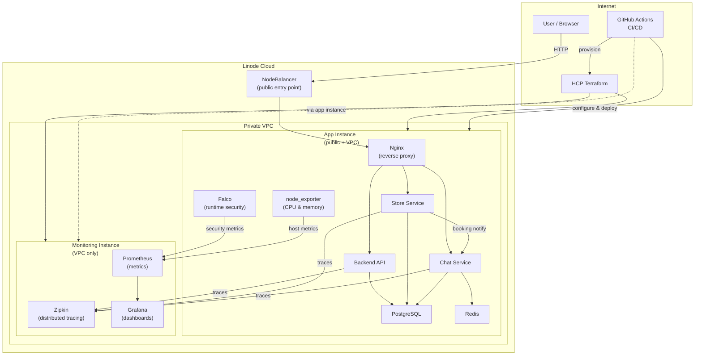

[](https://scorecard.dev/viewer/?uri=github.com/kennethatria/myGuy)

# MyGuy - Task Marketplace Platform

MyGuy is a modern, microservices-based task marketplace. It allows users to post tasks they need done, and enables other users to apply, negotiate, and complete those tasks.

The platform is designed with a clean architecture, separating concerns into distinct services for task management, real-time chat, and a store/bidding marketplace.

## Architecture & Tech Stack

### Infrastructure Diagram



### Application Services

| Service | Language | Port | Description |
| :--- | :--- | :--- | :--- |
| **Frontend** | TypeScript (Vue.js) | `5173` | The main user interface that communicates with all backend services. |
| **Backend** | Go (Gin) | `8080` | The core API for managing users, tasks, applications, and reviews. |
| **Store Service** | Go (Gin) | `8081` | A marketplace for items with fixed-price and auction-style bidding. |
| **Chat Service** | JavaScript (Node.js) | `8082` | A real-time WebSocket service for all messaging features. |
| **Database** | PostgreSQL | `5432` | Primary data store, with each service connecting to its own database. |
| **Redis** | Redis | `6379` | Socket.IO adapter for multi-instance chat scaling. |

### Monitoring Stack (Dedicated Instance)

| Tool | Port | Description |
| :--- | :--- | :--- |
| **Zipkin** | `9411` | Distributed tracing — collects spans from all backend services. |
| **Prometheus** | `9090` | Metrics collection — scrapes CPU/memory and Falco security alerts. |
| **Grafana** | `3000` | Visualization — dashboards for app metrics and security alerts. |

---

## Observability

MyGuy has two layers of observability: **distributed tracing** via OpenTelemetry + Zipkin, and **metrics + security alerting** via Prometheus + Grafana + Falco.

In production, all monitoring tools run on a dedicated server that is only accessible within the private VPC — not exposed to the public internet.

### Distributed Tracing (OpenTelemetry + Zipkin)

Every HTTP request handled by the backend, store service, or chat service is automatically traced. Spans are exported to Zipkin where you can visualise request flows, latency, and errors across services.

| Service | OTel Implementation | Service Name in Zipkin |
| :--- | :--- | :--- |
| **Backend** | Go SDK + `otelgin` middleware | `myguy-backend` |
| **Store Service** | Go SDK + `otelgin` middleware | `myguy-store-service` |
| **Chat Service** | Node.js SDK + Express/HTTP instrumentation | `myguy-chat-service` |

Each service reads `ZIPKIN_URL` from its environment:

```env
# Local development
ZIPKIN_URL=http://localhost:9411/api/v2/spans

# Production (via VPC)
ZIPKIN_URL=http://10.0.0.3:9411/api/v2/spans
```

### Metrics & Security Alerting (Prometheus + Grafana + Falco)

**On the app instance:**
- `node_exporter` runs as a systemd service on `:9100`, exposing CPU and memory metrics
- `falco` monitors system calls for suspicious runtime behaviour
- `falco-exporter` runs as a Podman container on `:9376`, exposing Falco alerts as Prometheus metrics

**On the monitoring instance:**
- Prometheus scrapes `node_exporter` (`:9100`) and `falco-exporter` (`:9376`) on the app instance via VPC every 15 seconds
- Grafana is pre-provisioned with Prometheus as a datasource and two dashboards:
  - **App Instance Metrics** — CPU usage (%) and memory usage (%)
  - **Falco Security Alerts** — alert rate by priority/rule and total alert count

Both Prometheus (`:9090`) and Grafana (`:3000`) are only reachable from within the VPC. To access them locally, SSH tunnel through the app instance:

```sh
ssh -L 3000:10.0.0.3:3000 root@<app_public_ip>
# then open http://localhost:3000
# default credentials: admin / admin
```

---

## Infrastructure & Deployment

The production infrastructure runs on Linode and is provisioned with Terraform and configured with Ansible.

### Servers

| Instance | VPC IP | Purpose |
| :--- | :--- | :--- |
| **App instance** | `10.0.0.2` | Runs the full application stack via Podman Compose |
| **Monitoring instance** | `10.0.0.3` | Runs Zipkin, Prometheus, and Grafana |

The monitoring instance has no public SSH access. It is only reachable via the app instance as a jump host.

### Provisioning with Terraform

```sh
cd infra
terraform init
terraform apply
```

After apply, get the app instance's public IP:

```sh
terraform output -raw instance_ip_address
```

Replace both `APP_INSTANCE_PUBLIC_IP` placeholders in `configuration_management/inventory.ini` with this value.

### Configuring with Ansible

```sh
cd configuration_management

# Run everything in order (monitoring first, then app infra, then app deploy)
ansible-playbook main.yml -i inventory.ini

# Or run individual playbooks
ansible-playbook monitoring.yml -i inventory.ini   # monitoring instance only
ansible-playbook site.yml -i inventory.ini         # app instance infrastructure
ansible-playbook deploy.yml -i inventory.ini       # app deployment
```

`deploy.yml` automatically reads the Zipkin URL from the monitoring play and writes it into the app's `.env` — no manual copy-paste needed.

**Required environment variables for `deploy.yml`:**

```sh
export REPO_URL=<your-repo-url>
export JWT_SECRET=<your-jwt-secret>
export DB_PASSWORD=<your-db-password>
export INTERNAL_API_KEY=<your-internal-api-key>
```

---

## Quick Start (Local Development)

The entire platform can be run locally using Podman Compose. Services use pre-built images from Docker Hub.

### Prerequisites
- Podman & Podman Compose
- Git

### Running the Application

1. **Clone the repository:**
   ```sh
   git clone <repository-url>
   cd myguy
   ```

2. **Create a root `.env` file** in the project root:
   ```env
   JWT_SECRET=your-secret-key-here
   DB_PASSWORD=mysecretpassword
   INTERNAL_API_KEY=your-internal-api-key-here
   ```

3. **Start the services:**
   ```sh
   podman compose up -d
   ```

4. **Access the application:**
   - **Frontend:** http://localhost:5173
   - **Backend API:** http://localhost:8080
   - **Store Service:** http://localhost:8081
   - **Chat Service:** http://localhost:8082
   - **Zipkin UI:** http://localhost:9411

---

## Documentation

- **[Project Status & Priorities](./engineering/❗-current-focus.md)** — current engineering priorities and recently completed work
- **[Backend README](./backend/README.md)**
- **[Store Service README](./store-service/README.md)**
- **[Chat Service README](./chat-websocket-service/README.md)**
- **[Frontend README](./frontend/README.md)**
- **[Engineering Docs](./engineering/)** — ADRs, RFCs, architecture docs
