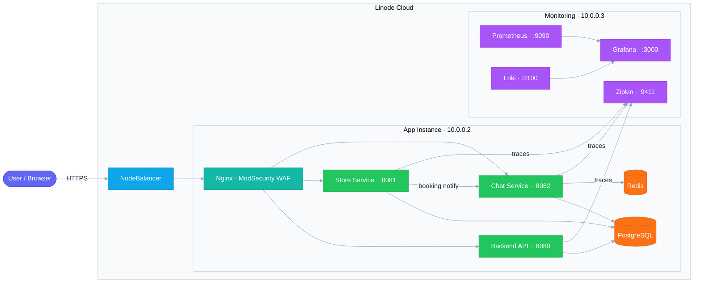
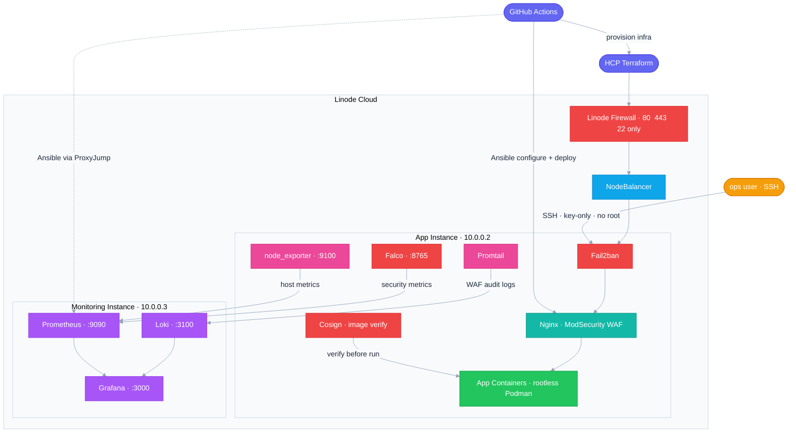

[](https://scorecard.dev/viewer/?uri=github.com/kennethatria/myGuy)

# MyGuy - Task Marketplace Platform

MyGuy is a modern, microservices-based task marketplace. It allows users to post tasks they need done, and enables other users to apply, negotiate, and complete those tasks.

The platform is designed with a clean architecture, separating concerns into distinct services for task management, real-time chat, and a store/bidding marketplace.

## Architecture & Tech Stack

### Application Diagram

Request flow from browser through to services, databases, and the monitoring stack.


```mermaid
%%{init: {'theme': 'base', 'themeVariables': {'primaryColor': '#ffffff', 'primaryBorderColor': '#cbd5e1', 'primaryTextColor': '#1e293b', 'clusterBkg': '#f8fafc', 'clusterBorder': '#cbd5e1', 'edgeLabelBackground': '#f8fafc', 'lineColor': '#94a3b8'}}}%%

graph LR
    classDef external   fill:#6366f1,stroke:#4f46e5,color:#fff
    classDef lb         fill:#0ea5e9,stroke:#0284c7,color:#fff
    classDef gateway    fill:#14b8a6,stroke:#0d9488,color:#fff
    classDef service    fill:#22c55e,stroke:#16a34a,color:#fff
    classDef database   fill:#f97316,stroke:#ea580c,color:#fff
    classDef monitoring fill:#a855f7,stroke:#9333ea,color:#fff

    User(["User / Browser"]):::external

    subgraph Linode["Linode Cloud"]
        NB["NodeBalancer"]:::lb

        subgraph App["App Instance · 10.0.0.2"]
            WAF["Nginx · ModSecurity WAF"]:::gateway
            API["Backend API · :8080"]:::service
            STORE["Store Service · :8081"]:::service
            CHAT["Chat Service · :8082"]:::service
            PG[("PostgreSQL")]:::database
            REDIS[("Redis")]:::database
        end

        subgraph Mon["Monitoring · 10.0.0.3"]
            ZIPKIN["Zipkin · :9411"]:::monitoring
            PROM["Prometheus · :9090"]:::monitoring
            LOKI["Loki · :3100"]:::monitoring
            GRAFANA["Grafana · :3000"]:::monitoring
        end
    end

    User -->|HTTPS| NB
    NB --> WAF
    WAF --> API
    WAF --> STORE
    WAF --> CHAT
    API --> PG
    STORE --> PG
    CHAT --> PG
    CHAT --> REDIS
    STORE -->|booking notify| CHAT
    API -->|traces| ZIPKIN
    STORE -->|traces| ZIPKIN
    CHAT -->|traces| ZIPKIN
    PROM --> GRAFANA
    LOKI --> GRAFANA
```

### Infrastructure & Security Diagram

How the platform is provisioned, deployed, and defended.


```mermaid
%%{init: {'theme': 'base', 'themeVariables': {'primaryColor': '#ffffff', 'primaryBorderColor': '#cbd5e1', 'primaryTextColor': '#1e293b', 'clusterBkg': '#f8fafc', 'clusterBorder': '#cbd5e1', 'edgeLabelBackground': '#f8fafc', 'lineColor': '#94a3b8'}}}%%

graph TB
    classDef external   fill:#6366f1,stroke:#4f46e5,color:#fff
    classDef lb         fill:#0ea5e9,stroke:#0284c7,color:#fff
    classDef security   fill:#ef4444,stroke:#dc2626,color:#fff
    classDef gateway    fill:#14b8a6,stroke:#0d9488,color:#fff
    classDef service    fill:#22c55e,stroke:#16a34a,color:#fff
    classDef monitoring fill:#a855f7,stroke:#9333ea,color:#fff
    classDef telemetry  fill:#ec4899,stroke:#db2777,color:#fff
    classDef user       fill:#f59e0b,stroke:#d97706,color:#fff

    GHA(["GitHub Actions"]):::external
    HCP(["HCP Terraform"]):::external
    OPS(["ops user · SSH"]):::user

    subgraph Linode["Linode Cloud"]
        FW["Linode Firewall · 80  443  22 only"]:::security
        NB["NodeBalancer"]:::lb

        subgraph App["App Instance · 10.0.0.2"]
            F2B["Fail2ban"]:::security
            WAF["Nginx · ModSecurity WAF"]:::gateway
            COSIGN["Cosign · image verify"]:::security
            PODS["App Containers · rootless Podman"]:::service
            FALCO["Falco · :8765"]:::security
            NE["node_exporter · :9100"]:::telemetry
            PROMTAIL["Promtail"]:::telemetry
        end

        subgraph Mon["Monitoring Instance · 10.0.0.3"]
            PROM["Prometheus · :9090"]:::monitoring
            LOKI["Loki · :3100"]:::monitoring
            GRAFANA["Grafana · :3000"]:::monitoring
        end
    end

    GHA -->|provision infra| HCP
    GHA -->|Ansible configure + deploy| WAF
    GHA -.->|Ansible via ProxyJump| PROM
    HCP --> FW
    OPS -->|SSH · key-only · no root| F2B
    FW --> NB
    NB --> F2B
    F2B --> WAF
    COSIGN -->|verify before run| PODS
    WAF --> PODS
    NE -->|host metrics| PROM
    FALCO -->|security metrics| PROM
    PROMTAIL -->|WAF audit logs| LOKI
    PROM --> GRAFANA
    LOKI --> GRAFANA
```

### Application Services

| Service | Language | Port | Description |
| :--- | :--- | :--- | :--- |
| **Frontend** | TypeScript (Vue.js) | `5173` | The main user interface that communicates with all backend services. |
| **Backend** | Go (Gin) | `8080` | The core API for managing users, tasks, applications, and reviews. |
| **Store Service** | Go (Gin) | `8081` | A marketplace for items with fixed-price and auction-style bidding. |
| **Chat Service** | JavaScript (Node.js) | `8082` | A real-time WebSocket service for all messaging features. |
| **Database** | PostgreSQL | `5432` | Primary data store, with each service connecting to its own database. |
| **Redis** | Redis | `6379` | Socket.IO adapter for multi-instance chat scaling. |

### Monitoring Stack (Dedicated Instance)

| Tool | Port | Description |
| :--- | :--- | :--- |
| **Zipkin** | `9411` | Distributed tracing — collects spans from all backend services. |
| **Prometheus** | `9090` | Metrics collection — scrapes CPU/memory and Falco security alerts. |
| **Grafana** | `3000` | Visualization — dashboards for app metrics, security alerts, and WAF detections. |
| **Loki** | `3100` | Log aggregation — receives ModSecurity audit logs shipped by Promtail. |

---

## Security

Security is implemented in layers — network, access control, HTTP, runtime, and supply chain. A failure at any one layer is contained by the layers beneath it.

### Network

| Control | Detail |
| :--- | :--- |
| **Linode Firewall** | Inbound allowlist: 80, 443, 22 only. Default policy: DROP. All other ports silently dropped at the network edge. |
| **Private VPC** | Monitoring instance (`10.0.0.3`) has no public IP. Reachable only via VPC — unreachable from the internet entirely. |
| **NodeBalancer** | Connection throttle of 20 connections/sec on HTTP. Acts as the single public entry point. |

### Access Control

Root SSH is disabled on every server. Two non-root accounts replace it.

| User | Scope | Auth |
| :--- | :--- | :--- |
| `myguy` | Runs app containers (rootless Podman) and Ansible automation. Sudo allowed for provisioning commands only — interactive shells explicitly blocked. | CI/CD SSH key |
| `ops` | Troubleshooting only. Sudo scoped to: container observe/restart (`appctl`), read `.env` secrets, `fail2ban-client status` and unban. Nothing else. | Personal SSH key |
| `node_exporter` | Dedicated no-login system account. Runs only the metrics daemon. No sudo, no shell. | — |
| `promtail` | Dedicated no-login system account. Member of `adm` group for log read access. No sudo, no shell. | — |

SSH hardening applied to both servers:

```
PermitRootLogin       no
PasswordAuthentication no
AllowAgentForwarding  no
X11Forwarding         no
```

### Brute Force Protection — Fail2ban

Four jails are active on the app instance:

| Jail | Watches | Threshold | Ban duration |
| :--- | :--- | :--- | :--- |
| `sshd` | SSH auth log | 3 failures in 10 min | 1 hour |
| `nginx-4xx` | nginx access log | 20 × 4xx in 5 min | 1 hour |
| `nginx-botsearch` | nginx access log | 2 hits to scanner paths | 24 hours |
| `nginx-modsecurity` | ModSecurity audit log | 3 WAF rule triggers | 24 hours |

### HTTP Security — Nginx + ModSecurity

- **TLS 1.2 / 1.3 only** — HTTP permanently redirected to HTTPS
- **Let's Encrypt** certificates via Certbot with auto-renewal
- **ModSecurity + OWASP Core Rule Set v4** — inspects every inbound request for SQLi, XSS, path traversal, RFI, and other OWASP Top 10 patterns
- Currently in **DetectionOnly** mode (logs, does not block) — WAF audit log feeds Fail2ban and Loki

### Container Security — Rootless Podman

Application containers run under the `myguy` user with no root involvement. If a container is compromised and an attacker escapes the container boundary, they land as the unprivileged `myguy` user — not root. `loginctl enable-linger` keeps the user session alive so containers restart on boot without root.

### Supply Chain — Cosign

Before every deployment, the CI/CD pipeline verifies the cryptographic signature of each application image using Cosign with GitHub Actions OIDC:

| Image verified |
| :--- |
| `myguy-api` |
| `myguy-store-service` |
| `myguy-chat-websocket-service` |

Deployment is aborted if any signature is missing or invalid.

### Runtime Security — Falco

Falco monitors system calls on the app instance in real time, detecting suspicious behaviour such as privilege escalation, unexpected file access, and container escape attempts. Alerts are exported as Prometheus metrics and visualised in Grafana with a dedicated **Falco Security Alerts** dashboard.

---

## Observability

MyGuy has two layers of observability: **distributed tracing** via OpenTelemetry + Zipkin, and **metrics + security alerting** via Prometheus + Grafana + Falco.

In production, all monitoring tools run on a dedicated server that is only accessible within the private VPC — not exposed to the public internet.

### Distributed Tracing (OpenTelemetry + Zipkin)

Every HTTP request handled by the backend, store service, or chat service is automatically traced. Spans are exported to Zipkin where you can visualise request flows, latency, and errors across services.

| Service | OTel Implementation | Service Name in Zipkin |
| :--- | :--- | :--- |
| **Backend** | Go SDK + `otelgin` middleware | `myguy-backend` |
| **Store Service** | Go SDK + `otelgin` middleware | `myguy-store-service` |
| **Chat Service** | Node.js SDK + Express/HTTP instrumentation | `myguy-chat-service` |

Each service reads `ZIPKIN_URL` from its environment:

```env
# Local development
ZIPKIN_URL=http://localhost:9411/api/v2/spans

# Production (via VPC)
ZIPKIN_URL=http://10.0.0.3:9411/api/v2/spans
```

### Metrics & Security Alerting (Prometheus + Grafana + Falco)

**On the app instance:**
- `node_exporter` runs as a systemd service on `:9100`, exposing CPU and memory metrics
- `falco` monitors system calls for suspicious runtime behaviour and exposes Prometheus metrics on `:8765`
- `promtail` ships ModSecurity audit logs to Loki on the monitoring instance

**On the monitoring instance:**
- Prometheus scrapes `node_exporter` (`:9100`) and Falco metrics (`:8765`) on the app instance via VPC every 15 seconds
- Grafana is pre-provisioned with three dashboards:
  - **App Instance Metrics** — CPU usage (%) and memory usage (%)
  - **Falco Security Alerts** — alert rate by priority/rule and total alert count
  - **WAF — ModSecurity Detections** — ModSecurity rule triggers visualised from Loki

Both Prometheus (`:9090`) and Grafana (`:3000`) are only reachable from within the VPC. To access them locally, SSH tunnel through the app instance as the `ops` user:

```sh
ssh -N \
  -L 3000:10.0.0.3:3000 \
  -L 9090:10.0.0.3:9090 \
  -L 9411:10.0.0.3:9411 \
  -L 3100:10.0.0.3:3100 \
  ops@<app_public_ip>
```

Then open `http://localhost:3000` for Grafana, `http://localhost:9411` for Zipkin.

---

## Infrastructure & Deployment

The production infrastructure runs on Linode and is provisioned with Terraform and configured with Ansible.

### Servers

| Instance | VPC IP | Purpose |
| :--- | :--- | :--- |
| **App instance** | `10.0.0.2` | Runs the full application stack via rootless Podman Compose |
| **Monitoring instance** | `10.0.0.3` | Runs Zipkin, Prometheus, Grafana, and Loki |

The monitoring instance has no public IP. It is only reachable via the app instance as a ProxyJump host.

### Provisioning with Terraform

```sh
cd infra
terraform init
terraform apply
```

After apply, get the app instance's public IP:

```sh
terraform output -raw instance_ip_address
```

The CI/CD workflow injects this IP into `configuration_management/inventory.ini` automatically.

### Configuring with Ansible

```sh
cd configuration_management

# Run everything in order
ansible-playbook main.yml -i inventory.ini \
  -e "ci_cd_public_key=$(cat ~/.ssh/id_ed25519.pub)" \
  -e "ops_ssh_public_key=$(cat ~/.ssh/id_ed25519.pub)"

# Or run individual playbooks
ansible-playbook users.yml -i inventory.ini \
  -e "ci_cd_public_key=..." \
  -e "ops_ssh_public_key=..."    # must run first on a new server

ansible-playbook monitoring.yml -i inventory.ini
ansible-playbook site.yml -i inventory.ini
ansible-playbook security.yml -i inventory.ini
ansible-playbook observability.yml -i inventory.ini
ansible-playbook deploy.yml -i inventory.ini \
  -e "repo_url=..." \
  -e "jwt_secret=..." \
  -e "db_password=..." \
  -e "internal_api_key=..." \
  -e "registry=..." \
  -e "image_tag=..." \
  -e "github_repository=..." \
  -e "domain=..." \
  -e "certbot_email=..."
```

> **Note:** `users.yml` must run first on any new server. It connects as root to create the `myguy` and `ops` users, then disables root SSH. All subsequent playbooks connect as `myguy`.

`deploy.yml` automatically reads the Zipkin URL from the monitoring play and writes it into the app's `.env` — no manual copy-paste needed.

---

## Quick Start (Local Development)

The entire platform can be run locally using Podman Compose. Services use pre-built images from Docker Hub.

### Prerequisites
- Podman & Podman Compose
- Git

### Running the Application

1. **Clone the repository:**
   ```sh
   git clone <repository-url>
   cd myguy
   ```

2. **Create a root `.env` file** in the project root:
   ```env
   JWT_SECRET=your-secret-key-here
   DB_PASSWORD=mysecretpassword
   INTERNAL_API_KEY=your-internal-api-key-here
   ```

3. **Start the services:**
   ```sh
   podman compose up -d
   ```

4. **Access the application:**
   - **Frontend:** http://localhost:5173
   - **Backend API:** http://localhost:8080
   - **Store Service:** http://localhost:8081
   - **Chat Service:** http://localhost:8082
   - **Zipkin UI:** http://localhost:9411

---

## Documentation

- **[Backend README](./backend/README.md)**
- **[Store Service README](./store-service/README.md)**
- **[Chat Service README](./chat-websocket-service/README.md)**
- **[Frontend README](./frontend/README.md)**
