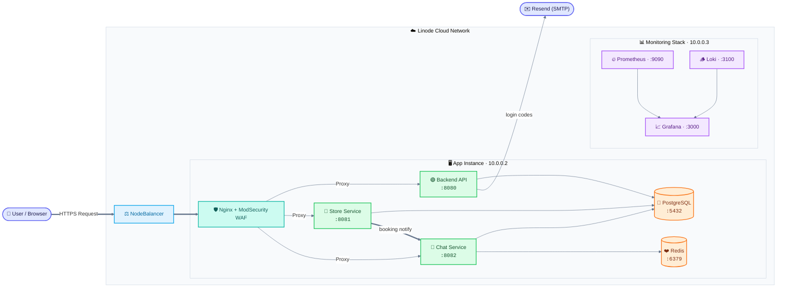

[](https://scorecard.dev/viewer/?uri=github.com/kennethatria/myGuy)

# MyGuy - Task Marketplace Platform

MyGuy is a modern, microservices-based task marketplace. It allows users to post tasks they need done, and enables other users to apply, negotiate, and complete those tasks.

The platform is designed with a clean architecture, separating concerns into distinct services for task management, real-time chat, and a marketplace.

## Architecture & Tech Stack

### Application Diagram

Request flow from browser through to services, databases, and the monitoring stack.


```mermaid
%%{init: {'theme': 'base', 'themeVariables': {'clusterBkg': '#f8fafc', 'clusterBorder': '#cbd5e1', 'edgeLabelBackground': '#ffffff', 'lineColor': '#64748b'}}}%%

graph LR
    %% Custom Semantic Styling
    classDef external   fill:#e0e7ff,stroke:#6366f1,color:#1e1b4b,stroke-width:2px;
    classDef lb         fill:#e0f2fe,stroke:#0ea5e9,color:#0369a1,stroke-width:2px;
    classDef gateway    fill:#ccfbf1,stroke:#14b8a6,color:#115e59,stroke-width:2px;
    classDef service    fill:#dcfce7,stroke:#22c55e,color:#14532d,stroke-width:2px;
    classDef database   fill:#ffedd5,stroke:#f97316,color:#7c2d12,stroke-width:2px;
    classDef monitoring fill:#f3e8ff,stroke:#a855f7,color:#581c87,stroke-width:2px;

    %% Nodes Definitions
    User(["👤 User / Browser"]):::external

    subgraph Linode["☁️ Linode Cloud Network"]
        NB["⚖️ NodeBalancer"]:::lb

        subgraph App["🖥️ App Instance · 10.0.0.2"]
            WAF["🛡️ Nginx + ModSecurity WAF"]:::gateway
            API["🟢 Backend API<br/><code>:8080</code>"]:::service
            STORE["🛒 Store Service<br/><code>:8081</code>"]:::service
            CHAT["💬 Chat Service<br/><code>:8082</code>"]:::service
            PG[("🐘 PostgreSQL<br/><code>:5432</code>")]:::database
            REDIS[("❤️ Redis<br/><code>:6379</code>")]:::database
        end

        subgraph Mon["📊 Monitoring Stack · 10.0.0.3"]
            PROM["🔥 Prometheus · :9090"]:::monitoring
            LOKI["🪵 Loki · :3100"]:::monitoring
            GRAFANA["📈 Grafana · :3000"]:::monitoring
        end
    end

    MAIL(["✉️ Resend (SMTP)"]):::external

    %% Flow Topology
    User ==>|HTTPS Request| NB
    NB ==> WAF
    
    WAF -->|Proxy| API
    WAF -->|Proxy| STORE
    WAF -->|Proxy| CHAT

    API ---> PG
    STORE ---> PG
    CHAT ---> PG
    CHAT ---> REDIS
    
    STORE ==>|booking notify| CHAT
    API -->|login codes| MAIL

    %% Telemetry & Logging
    
    PROM ---> GRAFANA
    LOKI ---> GRAFANA
```

### Infrastructure & Security Diagram

How the platform is provisioned, deployed, and defended.


```mermaid
%%{init: {'theme': 'base', 'themeVariables': {'clusterBkg': '#f8fafc', 'clusterBorder': '#cbd5e1', 'edgeLabelBackground': '#ffffff', 'lineColor': '#64748b'}}}%%

graph TB
    %% Custom Infrastructure & Security Styling
    classDef automation fill:#e0f2fe,stroke:#0ea5e9,color:#0369a1,stroke-width:2px;
    classDef admin      fill:#fef3c7,stroke:#f59e0b,color:#78350f,stroke-width:2px;
    classDef security   fill:#fee2e2,stroke:#ef4444,color:#7f1d1d,stroke-width:2px;
    classDef lb         fill:#e0f2fe,stroke:#0ea5e9,color:#0369a1,stroke-width:1px;
    classDef gateway    fill:#ccfbf1,stroke:#14b8a6,color:#115e59,stroke-width:1px;
    classDef runtime    fill:#dcfce7,stroke:#22c55e,color:#14532d,stroke-width:2px;
    classDef telemetry  fill:#fce7f3,stroke:#ec4899,color:#701a75,stroke-width:1px;
    classDef monitoring fill:#f3e8ff,stroke:#a855f7,color:#581c87,stroke-width:2px;

    %% Management Entities
    subgraph Controls ["⚡ Automation & Operations Control Plane"]
        direction LR
        GHA(["🐙 GitHub Actions"]):::automation
        HCP(["☁️ HCP Terraform"]):::automation
        OPS(["🧑‍💻 ops user (SSH Key)"]):::admin
    end

    %% Main Network Boundary
    subgraph Linode["☁️ Linode Cloud Perimeters"]
        FW["🔥 Linode Network Firewall<br/><i>Allow: 80, 443, 22 | Default: DROP</i>"]:::security
        NB["⚖️ NodeBalancer Ingress"]:::lb

        subgraph App["🖥️ Task Marketplace Core · App Instance (10.0.0.2)"]
            F2B["🚫 Fail2ban Jails"]:::security
            WAF["🌐 Nginx + ModSecurity WAF"]:::gateway
            COSIGN["🔐 Cosign Signature Verification"]:::security
            PODS["📦 Rootless Podman App Containers"]:::runtime
            FALCO["🦅 Falco Runtime Protection<br/><code>:8765</code>"]:::security
            NE["📊 node_exporter<br/><code>:9100</code>"]:::telemetry
            PROMTAIL["🪵 Promtail Shipper"]:::telemetry
        end

        subgraph Mon["📊 Dedicated Monitoring Instance (10.0.0.3 - VPC Only)"]
            PROM["🔥 Prometheus Core"]:::monitoring
            LOKI["🪵 Loki Aggregator"]:::monitoring
            GRAFANA["📈 Grafana Visualization"]:::monitoring
        end
    end

    %% Deployment & Provisioning Flow
    GHA -->|1. Terraform runs - manual| HCP
    HCP -->|Deploys Ruleset| FW
    GHA ==>|2. Ansible - auto app deploy on main| WAF
    GHA -.->|Ansible Bastion Tunnel| PROM
    OPS ==>|Targeted Troubleshooting| F2B

    %% Ingress Network Routing
    FW ==> NB
    NB ==> F2B
    F2B ==> WAF
    WAF ==> PODS
    COSIGN -.->|Guard rail check| PODS

    %% Telemetry, Metrics, and Audit Logs Pipelines
    NE -.->|host metrics| PROM
    FALCO -.->|security kernel events| PROM
    PROMTAIL -.->|WAF audit + access logs| LOKI
    
    PROM ---> GRAFANA
    LOKI ---> GRAFANA
```

### Application Services

| Service | Language | Port | Description |
| :--- | :--- | :--- | :--- |
| **Frontend** | TypeScript (Vue.js) | `5173` | The main user interface that communicates with all backend services. |
| **Backend** | Go (Gin) | `8080` | The core API: passwordless sign-in, users, tasks, applications, and reviews. |
| **Proximity Service** | Go (Gin) | `8083` (internal) | Rough locations of gigs, listings and requests; tells the other services how far each is, as a coarse bucket. Has its own Redis. |
| **Store Service** | Go (Gin) | `8081` | Marketplace listings and requests as sticky notes, with booking requests. No prices. |
| **Chat Service** | JavaScript (Node.js) | `8082` | A real-time WebSocket service for all messaging features. |
| **Database** | PostgreSQL | `5432` | Primary data store, with each service connecting to its own database. |
| **Redis** | Redis | `6379` | Socket.IO adapter for multi-instance chat scaling. |

### Monitoring Stack (Dedicated Instance)

| Tool | Port | Description |
| :--- | :--- | :--- |
| **Prometheus** | `9090` | Metrics collection — scrapes CPU/memory and Falco security alerts. |
| **Grafana** | `3000` | Visualization — dashboards for app metrics, security alerts, WAF detections, and visitors. |
| **Loki** | `3100` | Log aggregation — receives ModSecurity audit logs, the nginx JSON access log and app container logs from Promtail (8-day retention). |

All monitoring containers run as rootless Podman **Quadlet** units under `myguy`, so systemd starts, restarts, and boots them.

---

## Authentication

Sign-in is **passwordless**. One flow covers both login and sign-up:

1. The user enters their email address; the backend emails a **6-digit code** (`POST /api/v1/auth/request-code`).
2. The user enters the code (`POST /api/v1/auth/verify-code`). An existing account is signed in with a session JWT.
3. A new email instead gets a 15-minute signup token; the user enters their full name and the account is created with a username derived from the email (`POST /api/v1/auth/complete-signup`).

| Rule | Value |
| :--- | :--- |
| Code lifetime | 10 minutes, single use; requesting a new code invalidates the previous one |
| Wrong guesses | 5 per code, then the code is dead |
| Requests | 5 codes per email per hour (`429` after that) |
| Storage | Only an HMAC of the code is stored, never the code itself |
| Signup token | Signed with a key derived from `JWT_SECRET`, so it is never accepted as a session by any service |

Codes are sent over SMTP with mandatory STARTTLS (production uses [Resend](https://resend.com) on port `2587`). When `SMTP_HOST` is unset — e.g. local development — the backend **logs the code instead of emailing it**.

---

## How Gigs Work

| Step | Poster | Applicant |
| :--- | :--- | :--- |
| **Post** | Sticks a note on the board: a headline (≤ 5 words) and note (≤ 20 words), no contact details. It stays up 24 hours | — |
| **Apply** | Gets a 📩 *New application* message in Messages | Replies with a short message; price is agreed in chat. Can't apply twice or to their own gig |
| **Talk** | Presses **Message** on an application card to chat with that person | Chats with the poster from the gig page |
| **Decide** | Accepts one application (the gig moves to *In progress*, and the two can now share phone numbers in chat) or declines | Gets ✅ *accepted* or *not selected*; everyone else still waiting is told they weren't selected |
| **Track** | Dashboard shows "*N awaiting your reply*" per gig | Dashboard → **My Applications** shows each application's status |
| **Finish** | Either party marks it complete; both can then review each other | — |

There is **one private conversation per pair** (poster ↔ each person) per gig, shown on the gig page and in Messages. Posters can cancel a gig (pending applicants are told) and delete gigs that were never assigned.

**Expiry.** A note nobody applies to within 24 hours is marked *expired* and comes off the board; the poster can repost it from the gig page or dashboard for another 24 hours. A gig with at least one application stays open until the poster accepts someone or cancels.

**Contact details follow consent.** Phone numbers, emails, links and @handles are refused on notes and applications, and masked in chat, until the two people are matched (an accepted application, or an approved store booking). After that, chat between them is unfiltered.

### Marketplace listings

Selling works the same way. A listing is a sticky note with a headline (≤ 5 words), a note (≤ 20 words) and up to three photos (the first is taped to the note). There are no price, category or condition fields: put the price in the note or agree it in chat. A buyer presses **Book**; once the seller approves, the two can share contact details in chat. A listing nobody books within 24 hours expires; the seller can repost or remove it from the item page or the **Yours** tab.

**Requests.** Buyers can ask too. A request ("Printer wanted") is a note on the **Wanted** tab, with the same limits and 24-hour life. A seller who has the item presses **I have this** and posts a listing linked to the request; it goes on the board as usual, and the requester gets a message in Messages with a link to it. The requester books it like any listing, and once the seller approves that booking the request closes. A request no seller answers within 24 hours expires and can be reposted.

### Nearby first

When posting a gig, listing or request, people can add their rough area (about 500 m; never their exact spot; optional). Boards then show the nearest notes first, each tagged with a rough distance (`📍 ~2 km`), with notes that have no location after them. The board asks for the viewer's location only when they tap "Show what's near me"; if location is blocked, boards stay newest first. On a request's page, the listings made for it are ordered by distance from the requester.

### Notifications

Everything arrives in **Messages**, live, with an unread badge on the floating chat button and the Messages menu item: chat messages, task events (above), and store booking requests and updates. Event messages are system notices and can't be edited or deleted. There is no email or push notification yet; people who are offline see the unread counts next time they open the app.

### Ratings

A user's profile shows **one rating** combining task reviews (backend) and store ratings received as a seller or buyer (store service), with each review labelled by its gig or item.

---

## Security

Security is implemented in layers — network, access control, HTTP, runtime, and supply chain. A failure at any one layer is contained by the layers beneath it.

### Network

| Control | Detail |
| :--- | :--- |
| **Linode Firewall** | Inbound allowlist: 80, 443, 22 only. Default policy: DROP. All other ports silently dropped at the network edge. |
| **Private VPC** | Monitoring instance (`10.0.0.3`) has no public IP. Reachable only via VPC — unreachable from the internet entirely. |
| **NodeBalancer** | Single public entry point (`akalimu.com` and the old `myguy.work` DNS point here). Port 80 in HTTP mode (adds `X-Forwarded-For`, health-checks `/healthcheck/`); port 443 is TLS passthrough with **PROXY protocol v2**. Connection throttle of 20 connections/sec. |
| **Real client IPs** | nginx trusts only the NodeBalancer range (`192.168.255.0/24`) and restores each visitor's real IP from the PROXY header or `X-Forwarded-For`, so fail2ban, the WAF, logs, and the backends see the actual client — never the NodeBalancer. |

### Access Control

Root SSH is disabled on every server. Two non-root accounts replace it.

| User | Scope | Auth |
| :--- | :--- | :--- |
| `myguy` | Runs app containers (rootless Podman) and Ansible automation. Passwordless sudo, required by Ansible `become`. Protected by the CI/CD key, which lives only in the GitHub `dev` environment. | CI/CD SSH key |
| `ops` | Troubleshooting only. Sudo scoped to: container observe/restart (`appctl`), read `.env` secrets, `fail2ban-client status` and unban. Nothing else. | Personal SSH key |
| `node_exporter` | Dedicated no-login system account. Runs only the metrics daemon. No sudo, no shell. | — |
| `promtail` | Dedicated no-login system account. Member of `adm` group for log read access. No sudo, no shell. | — |

Emergency access without SSH is via the Akamai **LISH console** as `root` (password from the Terraform `root_password` variable).

SSH hardening applied to both servers:

```
PermitRootLogin       no
PasswordAuthentication no
AllowAgentForwarding  no
X11Forwarding         no
```

### Brute Force Protection — Fail2ban

Four jails are active on the app instance:

| Jail | Watches | Threshold | Ban duration |
| :--- | :--- | :--- | :--- |
| `sshd` | SSH auth log | 3 failures in 10 min | 1 hour |
| `nginx-4xx` | nginx access log | 20 × 4xx in 5 min | 1 hour |
| `nginx-botsearch` | nginx access log | 2 hits to scanner paths | 24 hours |
| `nginx-modsecurity` | ModSecurity audit log | 3 WAF rule triggers | 24 hours |

### HTTP Security — Nginx + ModSecurity

- **TLS 1.2 / 1.3 only** — HTTP permanently redirected to HTTPS (except the NodeBalancer health check, `/healthcheck/`)
- **Let's Encrypt** certificates via Certbot with auto-renewal
- **ModSecurity + OWASP Core Rule Set v4** — inspects every inbound request for SQLi, XSS, path traversal, RFI, and other OWASP Top 10 patterns
- Currently in **DetectionOnly** mode (logs, does not block) — WAF audit log feeds Fail2ban and Loki

### Container Security — Rootless Podman

Application containers run under the `myguy` user with no root involvement. If a container is compromised and an attacker escapes the container boundary, they land as the unprivileged `myguy` user — not root. `loginctl enable-linger` keeps the user session alive so containers restart on boot without root.

### Supply Chain — Cosign

Before every deployment, the CI/CD pipeline verifies the cryptographic signature of each application image using Cosign with GitHub Actions OIDC:

| Image verified |
| :--- |
| `myguy-api` |
| `myguy-store-service` |
| `myguy-chat-websocket-service` |

Deployment is aborted if any signature is missing or invalid.

### Runtime Security — Falco

Falco monitors system calls on the app instance in real time, detecting suspicious behaviour such as privilege escalation, unexpected file access, and container escape attempts. Alerts are exported as Prometheus metrics and visualised in Grafana with a dedicated **Falco Security Alerts** dashboard.

---

## Observability

MyGuy has **metrics, logs and alerting** via Prometheus + Loki + Grafana + Falco, and **distributed tracing** via OpenTelemetry + Jaeger.

In production, all monitoring tools run on a dedicated server that is only accessible within the private VPC — not exposed to the public internet.

### Distributed Tracing (OpenTelemetry + Jaeger)

Every HTTP request handled by the backend, store, chat and proximity services is traced with OpenTelemetry and sent over OTLP/HTTP to `OTEL_EXPORTER_OTLP_ENDPOINT`: in production Jaeger on the monitoring server (`http://10.0.0.3:4318`, written by `deploy.yml`), locally the Jaeger in `docker-compose.override.yml`. Both use `configuration_management/files/jaeger.yml`: the newest **20,000 traces are kept in memory** (lost when Jaeger restarts), in about 100 MB (limit 160 MB). Open Jaeger's UI at http://localhost:16686 (through the SSH tunnel in production). Jaeger 2.x dropped the API Grafana's Jaeger datasource used, so traces are viewed in Jaeger's UI, not Grafana. Requests to `/health` aren't traced (the site prober calls it every 15 seconds). `OTEL_TRACES_EXPORTER=none` turns export off in any service.

Tempo was used before but kept outgrowing its memory on the 1 GB monitoring server.

| Service | OTel Implementation | Service Name |
| :--- | :--- | :--- |
| **Backend** | Go SDK + `otelgin` middleware | `myguy-backend` |
| **Store Service** | Go SDK + `otelgin` middleware | `myguy-store-service` |
| **Chat Service** | Node.js SDK + Express/HTTP instrumentation | `myguy-chat-service` |
| **Proximity Service** | Go SDK + `otelgin` middleware | `myguy-proximity-service` |

Services don't pass trace context to each other yet, so a call from the backend or store to proximity or chat shows as its own trace.

Each service reads the standard `OTEL_EXPORTER_OTLP_ENDPOINT` from its environment (unset means `http://localhost:4318`):

```env
# Local development
OTEL_EXPORTER_OTLP_ENDPOINT=http://localhost:4318

# Production (via VPC)
OTEL_EXPORTER_OTLP_ENDPOINT=http://10.0.0.3:4318
```

### Metrics & Security Alerting (Prometheus + Grafana + Falco)

**On the app instance:**
- `node_exporter` runs as a systemd service on `:9100`, exposing CPU, memory and disk metrics
- `prometheus-podman-exporter` (Quadlet, as `myguy`, 64 MB limit) on `:9882` exposes memory and CPU per container, read from myguy's Podman API socket; the firewall opens it to the monitoring server only
- `falco` monitors system calls for suspicious runtime behaviour and exposes Prometheus metrics on `:8765`
- `promtail` ships ModSecurity audit logs, the nginx JSON access log (`/var/log/nginx/access.json.log`) and every app container's output to Loki on the monitoring instance. Containers log to the systemd journal (`log_driver = "journald"`, set by `deploy.yml`), so logs survive container replacement; lines carrying sign-in codes are dropped before shipping

**On the monitoring instance:**
- Prometheus scrapes `node_exporter` (`:9100`) on both servers (the app's via VPC, its own via `host.containers.internal`) and Falco metrics (`:8765`) on the app instance every 15 seconds It keeps 15 days of history in the `prometheus-data` volume; of Loki's own metrics only `up` is kept. Each full run also removes images no container uses on the monitoring server (report: *Report image cleanup* in the *Configure monitoring instance* step).
- Grafana sends **alerts to Telegram** (provisioned in `monitoring.yml`, folder *Alerts*): site down (a blackbox prober on the monitoring server loads `https://<DOMAIN>/` and `/health`, and checks that old domains answer 301), certificate expiring within 14 days, more than 10 server errors in 10 minutes, disk above 85 %, memory above 90 %, a scrape target down (Loki and Jaeger included), and any Falco rule match. Repeats every 12 hours while firing.
- Grafana is pre-provisioned with these dashboards:
  - **App Instance Metrics** / **Monitoring Instance Metrics** — CPU, memory and disk use now (green / amber / red) and over time, one dashboard per server; App Instance Metrics also shows memory and CPU per container
  - **Accounts** — accounts, new sign-ups, people active in gigs and the marketplace, and gigs, listings, requests and bookings by status. Counts only: the backend (`:9464`) and store-service (`:9465`) publish them from their databases (`internal/metrics`), on ports nginx doesn't route and the firewall opens to the monitoring server alone; no names or emails leave the app server
  - **Falco Security Alerts** — whether Falco is reachable, alert count, and alerts by rule
  - **WAF — ModSecurity Detections** — ModSecurity rule triggers visualised from Loki
  - **Visitors** — IPs whose browser ran the app, signed-in IPs, app requests, server errors, pages opened directly, referrers and response codes, from the nginx access log (IP-based: one phone on mobile data counts many times)
  - **Service Logs** — every service's output in one place: lines and errors per service, and a searchable log view (8-day retention)

Both Prometheus (`:9090`) and Grafana (`:3000`) are only reachable from within the VPC. To access them locally, SSH tunnel through the app instance as the `ops` user:

```sh
ssh -N \
  -L 3000:10.0.0.3:3000 \
  -L 9090:10.0.0.3:9090 \
  -L 3100:10.0.0.3:3100 \
  -L 16686:10.0.0.3:16686 \
  ops@<app_public_ip>
```

Then open `http://localhost:3000` for Grafana (sign in as `admin` with the `GRAFANA_ADMIN_PASSWORD` secret) and `http://localhost:16686` for Jaeger (traces).

### Visitor Analytics

**Grafana → Visitors** counts client IPs whose browser ran the app (downloaded its code or called the API), plus app usage, from the nginx access log. Approximate: it counts IPs, not people (a phone on mobile data counts again with each new IP), and sees only full page loads, not in-app navigation. Every unknown path returns 404, and scanners posing as browsers are left out by requiring the app to actually run. Query strings are never logged. Umami (session-accurate visitors, events, heatmaps) was removed to free memory on the 1 GB monitoring server; its database volume `umami-db-data` is still there until deleted.

---

## Infrastructure & Deployment

The production infrastructure runs on Linode (Akamai Cloud), is provisioned with Terraform (HCP Terraform workspace `dev-myguy`), and is configured with Ansible. The domain's DNS `A` record must point at the **NodeBalancer** IP (Terraform output `nodebalancer_ipv4`), not an instance.

### CI/CD Pipeline

`.github/workflows/ci.cd.yml` orchestrates the reusable `component.*` workflows:

| Trigger | What runs |
| :--- | :--- |
| **Pull request** | Commit lint → tests and coverage (all four services) · CodeQL |
| **Push to `main`** | Tests and coverage → images built, **Cosign-signed**, pushed to Docker Hub → **automatic deploy** (`Run ansible`: scope `full` when Ansible provisioning files changed, i.e. anything in `configuration_management/` but `deploy.yml` and `templates/`; otherwise scope `app`). Release Please, SBOM, and Scorecard run alongside. |

Each stage only runs if the previous one passed, so failing tests never reach production. Deploys are serialised (one at a time per environment).

| Workflow | When to run it manually |
| :--- | :--- |
| **Run ansible**, scope `app` | Re-deploy the current images and frontend (same as the automatic deploy). |
| **Run ansible**, scope `full` | New servers, or to re-apply provisioning by hand (pushes to `main` that change it already run it). |
| **Terraform** (`component.infra.tf.deploy.yml`) | Any change under `infra/`. Kept manual so plans are reviewed — instance changes can replace servers. |

Image tags: CI tags images with the latest GitHub release (or `latest` if none); the deploy writes that tag to the server's `.env` as `IMAGE_TAG`, so the server runs exactly the image whose signature was verified.

### GitHub Environment (`dev`) Configuration

| Name | Kind | Purpose |
| :--- | :--- | :--- |
| `SSH_PRIVATE_KEY` | Secret | CI deploy key (ed25519). Its public half must be the Terraform `authorized_keys` variable. |
| `OPS_SSH_PUBLIC_KEY` | Secret | Public key for the `ops` troubleshooting user. |
| `TELEGRAM_BOT_TOKEN`, `TELEGRAM_CHAT_ID` | Secret | Grafana alerts go to this Telegram bot and chat (a private channel's id starts with `-100`). Unset, the rules still show in Grafana → Alerting but nothing is sent. |
| `GRAFANA_ADMIN_PASSWORD` | Secret | Grafana's `admin` password (12+ characters). `monitoring.yml` refuses to run without it and resets Grafana to it on every full run. |
| `JWT_SECRET`, `POSTGRES_PASSWORD`, `INTERNAL_API_KEY` | Secret | Application secrets written to the server `.env`. |
| `DOCKERHUB_USERNAME`, `DOCKERHUB_TOKEN` | Secret | Image push and pull (tokens expire — renew on Docker Hub). |
| `TF_API_TOKEN` | Secret | Reads Terraform outputs (server IP). |
| `CERTBOT_EMAIL`, `REPO_URL` | Secret | Let's Encrypt registration; repository cloned on the server. |
| `SMTP_PASSWORD` | Secret | SMTP password (Resend API key). |
| `DOMAIN`, `REGISTRY` | Variable | e.g. `akalimu.com`, `docker.io/katria47`. Old domains listed in `redirect_domains` (`configuration_management/group_vars/app.yml`) keep their certificates and redirect to `DOMAIN`; changing `DOMAIN` keeps HTTPS up while the new certificate is issued (its DNS must already point at the NodeBalancer). |
| `SMTP_HOST`, `SMTP_PORT`, `SMTP_USERNAME`, `SMTP_FROM` | Variable | e.g. `smtp.resend.com`, `2587`, `resend`, `MyGuy <no-reply@myguy.work>`. Akamai blocks outbound 25/465/587 on new accounts, so prefer the provider's alternate port. |

Terraform variables (`authorized_keys`, `root_password`, `provider_token`) live in the HCP Terraform workspace. `authorized_keys` must be a single-line public key; the Akamai API token needs **Events: read** in addition to Linodes, NodeBalancers, Firewalls, VPCs, and IPs.

### Servers

| Instance | VPC IP | Purpose |
| :--- | :--- | :--- |
| **App instance** | `10.0.0.2` | Runs the full application stack via rootless Podman Compose |
| **Monitoring instance** | `10.0.0.3` | Runs Prometheus, Grafana, Loki, Jaeger and the blackbox prober |

The monitoring instance has no public IP. It is only reachable via the app instance as a ProxyJump host.

- **Compose files:** `docker-compose.yml` is the production stack; `docker-compose.override.yml` adds local-only services (Jaeger for traces) and is loaded automatically by `podman compose` / `docker compose` on your machine. Production runs `podman compose -f docker-compose.yml …`, so traces go to the monitoring server's Tempo instead.
- **Journal size:** both servers cap the systemd journal at 100 MB (`/etc/systemd/journald.conf.d/size.conf`, applied by `site.yml` / `monitoring.yml`) to keep memory free on the 1 GB instances.

### Provisioning with Terraform

```sh
cd infra
terraform init
terraform apply
```

After apply, get the app instance's public IP:

```sh
terraform output -raw instance_ip_address
```

The CI/CD workflow injects this IP into `configuration_management/inventory.ini` automatically.

### Configuring with Ansible

```sh
cd configuration_management

# Run everything in order
ansible-playbook main.yml -i inventory.ini \
  -e "ci_cd_public_key=$(cat ~/.ssh/id_ed25519.pub)" \
  -e "ops_ssh_public_key=$(cat ~/.ssh/id_ed25519.pub)"

# Or run individual playbooks
ansible-playbook users.yml -i inventory.ini \
  -e "ci_cd_public_key=..." \
  -e "ops_ssh_public_key=..."    # must run first on a new server

ansible-playbook monitoring.yml -i inventory.ini
ansible-playbook site.yml -i inventory.ini
ansible-playbook security.yml -i inventory.ini
ansible-playbook observability.yml -i inventory.ini
ansible-playbook deploy.yml -i inventory.ini \
  -e "repo_url=..." \
  -e "jwt_secret=..." \
  -e "db_password=..." \
  -e "internal_api_key=..." \
  -e "registry=..." \
  -e "image_tag=..." \
  -e "github_repository=..." \
  -e "domain=..." \
  -e "certbot_email=..." \
  -e "smtp_host=... smtp_port=... smtp_username=... smtp_from=..." \
  -e "smtp_password=..."
```

> **Note:** `users.yml` must run first on any new server. It logs in as `root` on a fresh server (or as `myguy` once bootstrapped, when root SSH is already disabled), creates the `myguy` and `ops` users, then disables root SSH. All subsequent playbooks connect as `myguy`.

> **Tip:** `-e "key=value"` splits on spaces. For values containing spaces (SSH public keys, `SMTP_FROM`), pass JSON instead: `-e '{"smtp_from": "MyGuy <no-reply@myguy.work>"}'` — the CI workflow builds its extra-vars this way with `jq`.

`deploy.yml` writes `OTEL_EXPORTER_OTLP_ENDPOINT=http://<monitoring VPC IP>:4318` into the app's `.env`, so traces go to Jaeger.

---

## Quick Start (Local Development)

The backend services run locally with Podman Compose using pre-built images from Docker Hub; the frontend runs with the Vite dev server.

### Prerequisites
- Podman & Podman Compose
- Node.js 22+
- Git

### Running the Application

1. **Clone the repository:**
   ```sh
   git clone <repository-url>
   cd myguy
   ```

2. **Create a root `.env` file** in the project root:
   ```env
   JWT_SECRET=your-secret-key-here
   DB_PASSWORD=mysecretpassword
   INTERNAL_API_KEY=your-internal-api-key-here
   # Optional: leave SMTP_HOST unset to log sign-in codes instead of emailing them
   # SMTP_HOST=smtp.resend.com
   # Optional: image tag to run (default: latest)
   # IMAGE_TAG=latest
   ```

3. **Start the backend services** (also starts a local Jaeger from `docker-compose.override.yml`):
   ```sh
   podman compose up -d
   ```

4. **Start the frontend:**
   ```sh
   cd frontend
   npm install
   npm run dev
   ```

5. **Sign in:** open the frontend, enter any email, and read the code from the API logs:
   ```sh
   podman compose logs api | grep "login code"
   ```

6. **Access the application:**
   - **Frontend:** http://localhost:5173
   - **Backend API:** http://localhost:8080
   - **Store Service:** http://localhost:8081
   - **Chat Service:** http://localhost:8082
   - **Traces (Jaeger):** http://localhost:16686
   - **PostgreSQL:** `localhost:5433`

---

## Documentation

- **[Backend README](./backend/README.md)**
- **[Store Service README](./store-service/README.md)**
- **[Chat Service README](./chat-websocket-service/README.md)**
- **[Frontend README](./frontend/README.md)**
