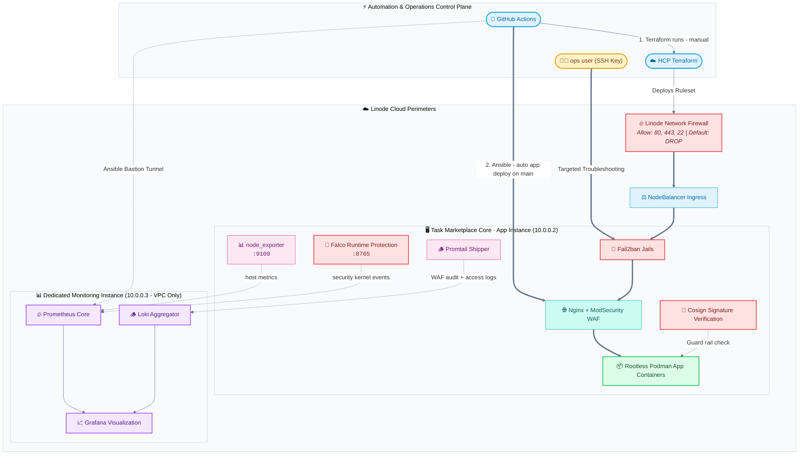

[](https://scorecard.dev/viewer/?uri=github.com/kennethatria/myGuy)

# MyGuy

A task marketplace and second-hand market on sticky notes: post a short note for a gig or an item, agree the details in chat, review each other. Built as Go and Node.js microservices with a Vue frontend, running on two small Linode servers.

**Jump to:** [Quick start](#quick-start-local-development) · [How MyGuy works](#how-it-works) · [Architecture](#architecture) · [Security](#security) · [Observability](#observability) · [Security runbook](#runbook) · [Infrastructure & deployment](#infrastructure) · [Service docs](#documentation)

Sections marked ▶ are collapsed: click a title to open it.

## Quick Start (Local Development)

The backend services run locally with Podman Compose using pre-built images from Docker Hub; the frontend runs with the Vite dev server.

### Prerequisites
- Podman & Podman Compose
- Node.js 22+
- Git

### Running the Application

1. **Clone the repository:**
   ```sh
   git clone <repository-url>
   cd myguy
   ```

2. **Create a root `.env` file** in the project root:
   ```env
   JWT_SECRET=your-secret-key-here
   DB_PASSWORD=mysecretpassword
   INTERNAL_API_KEY=your-internal-api-key-here
   # Optional: leave SMTP_HOST unset to log sign-in codes instead of emailing them
   # SMTP_HOST=smtp.resend.com
   # Optional: image tag to run (default: latest)
   # IMAGE_TAG=latest
   ```

3. **Start the backend services** (also starts a local Jaeger from `docker-compose.override.yml`):
   ```sh
   podman compose up -d
   ```

4. **Start the frontend:**
   ```sh
   cd frontend
   npm install
   npm run dev
   ```

5. **Sign in:** open the frontend, enter any email, and read the code from the API logs:
   ```sh
   podman compose logs api | grep "login code"
   ```

6. **Access the application:**
   - **Frontend:** http://localhost:5173
   - **Backend API:** http://localhost:8080
   - **Store Service:** http://localhost:8081
   - **Chat Service:** http://localhost:8082
   - **Traces (Jaeger):** http://localhost:16686
   - **PostgreSQL:** `localhost:5433`

## At a glance

| Service | Language | Port | What it does | Docs |
| :--- | :--- | :--- | :--- | :--- |
| **Frontend** | Vue 3 + TypeScript | `5173` | The app: boards, floating chat, radar | [README](./frontend/README.md) |
| **Backend** | Go (Gin) | `8080` | Passwordless sign-in, users, gigs, applications, reviews | [README](./backend/README.md) |
| **Store service** | Go (Gin) | `8081` | Listings, requests, bookings | [README](./store-service/README.md) |
| **Chat service** | Node.js (Socket.IO) | `8082` | Real-time messaging and events | [README](./chat-websocket-service/README.md) |
| **Proximity service** | Go (Gin) | `8083` (internal) | Rough locations and distance buckets | [README](./proximity-service/README.md) |
| **PostgreSQL** | PostgreSQL 15 | `5432` (`5433` on the host) | One database per service | — |
| **Redis** | Redis 7 | `6379` | Socket.IO adapter for multi-instance chat; the proximity service has its own | — |

Services never read each other's databases. The rules every change has to keep are in [CLAUDE.md](./claude.md).

<details id="how-it-works">
<summary><b>How MyGuy works</b> — sign-in, gigs, marketplace, chat, nearby, ratings</summary>

Everything happens on **sticky notes** and in the **floating chat**: there is no Messages page and no prices on the board (price is agreed in chat).

### Sign-in

Sign-in is **passwordless**. One flow covers both login and sign-up:

1. The user enters their email address; the backend emails a **6-digit code** (`POST /api/v1/auth/request-code`). It answers `202` once the code is stored and sends the email in the background (`mailer.Background`), so the form doesn't wait about a second for the mail server; a failed send is logged and the user asks for another code.
2. The user enters the code (`POST /api/v1/auth/verify-code`). An existing account is signed in with a session JWT.
3. A new email instead gets a 15-minute signup token; the user enters their full name and the account is created with a username derived from the email (`POST /api/v1/auth/complete-signup`).

| Rule | Value |
| :--- | :--- |
| Code lifetime | 10 minutes, single use; requesting a new code invalidates the previous one |
| Wrong guesses | 5 per code, then the code is dead |
| Requests | 5 codes per email per hour (`429` after that) |
| Storage | Only an HMAC of the code is stored, never the code itself |
| Signup token | Signed with a key derived from `JWT_SECRET`, so it is never accepted as a session by any service |

Codes are sent over SMTP with mandatory STARTTLS (production uses [Resend](https://resend.com) on port `2587`). When `SMTP_HOST` is unset — e.g. local development — the backend **logs the code instead of emailing it**.

**Sign-in log (email ↔ IP).** Each step is logged with the address and the visitor's IP: `auth event=code_sent|limited|wrong_code|signed_in|new_account|signed_up|blocked|failed email="…" ip=…` (`internal/api/handlers.go`, `logAuthEvent`). The code itself is never logged. The IP comes from nginx's `X-Real-IP` (`TrustedPlatform`), so a visitor can't fake it with their own `X-Forwarded-For`. The lines go to Loki with the API's output (8 days, personal data: kept no longer). They show which addresses an IP tried, and from which IPs an address got codes.

**Blocking an email.** An address that abuses the app can be blocked (by the address, so the same person can't sign up again with it):

- **Sign-in:** asking for a code answers `202` as usual but sends nothing (`auth event=blocked`), so a block isn't revealed. A code sent before the block, and sign-up, are refused (`403`, `code: account_unavailable`).
- **Sessions:** the backend keeps the blocked accounts in memory, reloaded every minute (timed blocks run out on their own). Store-service and chat read them from `GET /internal/v1/blocked-users` every minute (`BACKEND_INTERNAL_URL`). Every service then refuses those sessions (`401`, `code: account_unavailable`), and the app signs out on it. Chat also drops their sockets.
- **Their posts:** their open gigs, listings and requests leave the boards and the radar. Nothing is deleted, so they come back when the block is lifted.
- **People they were talking to:** each of their conversations gets a note, *"This account has been flagged for breaking the site rules."*, and closes to typing (listed with the ended ones). Unblocking posts *"This account is active again."* and reopens them. Chat's `account_notices` table makes each note go out once, whatever the number of chat instances or restarts.
- **Endpoints** (backend, `X-Internal-API-Key: INTERNAL_API_KEY`; nginx never routes `/internal`): `POST /internal/v1/email-blocks` `{email, reason, days (0: for good), by}`, `DELETE /internal/v1/email-blocks/:email`, `GET /internal/v1/email-blocks[/:email]`, `GET /internal/v1/blocked-users`. Each block and unblock is logged (`block event=blocked|unblocked`).

### Gigs

| Step | Poster | Person who applies |
| :--- | :--- | :--- |
| **Post** | Sticks a note on the board: a headline (≤ 5 words) and a note (≤ 20 words), no fee, deadline or contact details. It stays up 24 hours | — |
| **Apply** | Gets the application as a message in the floating chat | One tap opens the chat with the poster, with a short message. Nobody can apply twice or to their own gig |
| **Decide** | **Accept** or **Decline** on that message. Accepting starts the gig and opens the chat for typing | Gets *accepted* or *declined* in the same chat |
| **Do it** | — | **Mark as done** when finished |
| **Finish** | **Approve** (completed) or **Not yet** | — |
| **Review** | Both review each other in the chat | |

- **One conversation per pair:** poster and that person, per gig. It's closed to typing until the poster accepts. When the gig is completed, declined or cancelled, the conversation stays readable (and reviews can still be left), but takes no new messages and is listed last.
- **Expiry:** a note nobody applies to within 24 hours is marked *expired* and comes off the board. The poster can repost it (another 24 hours) or cancel it. Boards show a note only within its 24 hours.
- **Cancelling:** a gig nobody was assigned can be removed, and its waiting applicants are told. A gig someone is doing can be cancelled, and that person and the applicants are told.
- **Your own:** gigs and applications are under **My Gigs** (side navigation). Completed gigs are hidden there.

### Marketplace

- **Listings:** a note with a headline (≤ 5 words), a note (≤ 20 words) and up to three photos. No price, category or condition fields.
- **Booking:** **Book** is one tap that opens the chat with the seller. A buyer gets one booking request per item.
- **Approving:** the seller answers on the booking card in chat. Approving reserves the item: it's off the board and the chat opens for typing.
- **Handover:** the seller marks it **Picked up**, the buyer presses **Confirm received** (sold), and both review.
- **Releasing:** the seller can **Release reservation** from the chat. The item goes back up for 24 hours, and that buyer can't book it again.
- **Expiry and removal:** a listing nobody books within 24 hours expires and can be reposted or removed. Removing a listing declines its waiting bookings and tells each buyer in chat.
- **Requests:** buyers can post a *Wanted* note too. A seller presses **I have this** and posts a listing linked to it. The requester gets a message with **Book it**, and approving their booking marks the request fulfilled.

### Contact details follow consent

Phone numbers, emails, links and @handles are refused on notes, applications, listings and booking messages, and masked in chat, until the two people are matched (an accepted application or an approved booking). After that their chat is unfiltered.

### Nearby first

When posting, people can add their rough area (about 500 m, never their exact spot, optional). Home shows a **Near you** radar of other people's nearest gigs, items and requests, by rough distance only. Boards show the nearest notes first, tagged `📍 ~2 km`, when the viewer taps *Show what's near me*. Location is never asked for unprompted.

### Notifications

Everything arrives live in the floating chat, with an unread badge: chat messages, gig events and booking steps. Events are system messages and can't be edited or deleted. There's no email or push notification yet.

### Ratings

A profile shows one rating combining gig reviews (backend) and marketplace ratings (store service). **Reviews** shows your network as circles: who rated whom, coloured by the average rating.

</details>

<details id="architecture">
<summary><b>Architecture</b> — diagrams, services, monitoring stack</summary>

### Application Diagram

Request flow from browser through to services, databases, and the monitoring stack.


```mermaid
%%{init: {'theme': 'base', 'themeVariables': {'clusterBkg': '#f8fafc', 'clusterBorder': '#cbd5e1', 'edgeLabelBackground': '#ffffff', 'lineColor': '#64748b'}}}%%

graph LR
    %% Custom Semantic Styling
    classDef external   fill:#e0e7ff,stroke:#6366f1,color:#1e1b4b,stroke-width:2px;
    classDef lb         fill:#e0f2fe,stroke:#0ea5e9,color:#0369a1,stroke-width:2px;
    classDef gateway    fill:#ccfbf1,stroke:#14b8a6,color:#115e59,stroke-width:2px;
    classDef service    fill:#dcfce7,stroke:#22c55e,color:#14532d,stroke-width:2px;
    classDef database   fill:#ffedd5,stroke:#f97316,color:#7c2d12,stroke-width:2px;
    classDef monitoring fill:#f3e8ff,stroke:#a855f7,color:#581c87,stroke-width:2px;

    %% Nodes Definitions
    User(["👤 User / Browser"]):::external

    subgraph Linode["☁️ Linode Cloud Network"]
        NB["⚖️ NodeBalancer"]:::lb

        subgraph App["🖥️ App Instance · 10.0.0.2"]
            WAF["🛡️ Nginx + ModSecurity WAF"]:::gateway
            API["🟢 Backend API<br/><code>:8080</code>"]:::service
            STORE["🛒 Store Service<br/><code>:8081</code>"]:::service
            CHAT["💬 Chat Service<br/><code>:8082</code>"]:::service
            PG[("🐘 PostgreSQL<br/><code>:5432</code>")]:::database
            REDIS[("❤️ Redis<br/><code>:6379</code>")]:::database
        end

        subgraph Mon["📊 Monitoring Stack · 10.0.0.3"]
            PROM["🔥 Prometheus · :9090"]:::monitoring
            LOKI["🪵 Loki · :3100"]:::monitoring
            GRAFANA["📈 Grafana · :3000"]:::monitoring
        end
    end

    MAIL(["✉️ Resend (SMTP)"]):::external

    %% Flow Topology
    User ==>|HTTPS Request| NB
    NB ==> WAF
    
    WAF -->|Proxy| API
    WAF -->|Proxy| STORE
    WAF -->|Proxy| CHAT

    API ---> PG
    STORE ---> PG
    CHAT ---> PG
    CHAT ---> REDIS
    
    STORE ==>|booking notify| CHAT
    API -->|login codes| MAIL

    %% Telemetry & Logging
    
    PROM ---> GRAFANA
    LOKI ---> GRAFANA
```

### Infrastructure & Security Diagram

How the platform is provisioned, deployed, and defended.


```mermaid
%%{init: {'theme': 'base', 'themeVariables': {'clusterBkg': '#f8fafc', 'clusterBorder': '#cbd5e1', 'edgeLabelBackground': '#ffffff', 'lineColor': '#64748b'}}}%%

graph TB
    %% Custom Infrastructure & Security Styling
    classDef automation fill:#e0f2fe,stroke:#0ea5e9,color:#0369a1,stroke-width:2px;
    classDef admin      fill:#fef3c7,stroke:#f59e0b,color:#78350f,stroke-width:2px;
    classDef security   fill:#fee2e2,stroke:#ef4444,color:#7f1d1d,stroke-width:2px;
    classDef lb         fill:#e0f2fe,stroke:#0ea5e9,color:#0369a1,stroke-width:1px;
    classDef gateway    fill:#ccfbf1,stroke:#14b8a6,color:#115e59,stroke-width:1px;
    classDef runtime    fill:#dcfce7,stroke:#22c55e,color:#14532d,stroke-width:2px;
    classDef telemetry  fill:#fce7f3,stroke:#ec4899,color:#701a75,stroke-width:1px;
    classDef monitoring fill:#f3e8ff,stroke:#a855f7,color:#581c87,stroke-width:2px;

    %% Management Entities
    subgraph Controls ["⚡ Automation & Operations Control Plane"]
        direction LR
        GHA(["🐙 GitHub Actions"]):::automation
        HCP(["☁️ HCP Terraform"]):::automation
        OPS(["🧑‍💻 ops user (SSH Key)"]):::admin
    end

    %% Main Network Boundary
    subgraph Linode["☁️ Linode Cloud Perimeters"]
        FW["🔥 Linode Network Firewall<br/><i>Allow: 80, 443, 22 | Default: DROP</i>"]:::security
        NB["⚖️ NodeBalancer Ingress"]:::lb

        subgraph App["🖥️ Task Marketplace Core · App Instance (10.0.0.2)"]
            F2B["🚫 Fail2ban Jails"]:::security
            WAF["🌐 Nginx + ModSecurity WAF"]:::gateway
            COSIGN["🔐 Cosign Signature Verification"]:::security
            PODS["📦 Rootless Podman App Containers"]:::runtime
            FALCO["🦅 Falco Runtime Protection<br/><code>:8765</code>"]:::security
            NE["📊 node_exporter<br/><code>:9100</code>"]:::telemetry
            PROMTAIL["🪵 Promtail Shipper"]:::telemetry
        end

        subgraph Mon["📊 Dedicated Monitoring Instance (10.0.0.3 - VPC Only)"]
            PROM["🔥 Prometheus Core"]:::monitoring
            LOKI["🪵 Loki Aggregator"]:::monitoring
            GRAFANA["📈 Grafana Visualization"]:::monitoring
        end
    end

    %% Deployment & Provisioning Flow
    GHA -->|1. Terraform runs - manual| HCP
    HCP -->|Deploys Ruleset| FW
    GHA ==>|2. Ansible - auto app deploy on main| WAF
    GHA -.->|Ansible Bastion Tunnel| PROM
    OPS ==>|Targeted Troubleshooting| F2B

    %% Ingress Network Routing
    FW ==> NB
    NB ==> F2B
    F2B ==> WAF
    WAF ==> PODS
    COSIGN -.->|Guard rail check| PODS

    %% Telemetry, Metrics, and Audit Logs Pipelines
    NE -.->|host metrics| PROM
    FALCO -.->|security kernel events| PROM
    PROMTAIL -.->|WAF audit + access logs| LOKI
    
    PROM ---> GRAFANA
    LOKI ---> GRAFANA
```

### Monitoring Stack (Dedicated Instance)

| Tool | Port | Description |
| :--- | :--- | :--- |
| **Prometheus** | `9090` | Metrics collection — scrapes CPU/memory and Falco security alerts. |
| **Grafana** | `3000` | Dashboards and Telegram alerts (see Observability). |
| **Loki** | `3100` | Log aggregation from Promtail on both servers: WAF audit log, nginx access log, fail2ban, SSH, sudo, Falco events, app containers, deploy markers (8-day retention). |
| **Jaeger** | `4318` / `16686` | Traces from all four services (OTLP in, UI out); newest 20,000 kept in memory. |
| **Blackbox prober** | `9115` | Loads the site from outside the app server for the *Site down* and certificate alerts. |
| **Security checks** | — | `myguy-security` (systemd timers): per-IP attack and SSH-login messages, daily and weekly summaries, `investigate <IP>`. |

All monitoring containers run as rootless Podman **Quadlet** units under `myguy`, so systemd starts, restarts, and boots them.

</details>

<details id="security">
<summary><b>Security</b> — network, access, fail2ban, WAF, containers, supply chain, Falco</summary>

Security is layered: a failure at one layer is contained by the ones beneath it.


### Network

| Control | Detail |
| :--- | :--- |
| **Linode Firewall** | Inbound allowlist: 80, 443, 22 only. Default policy: DROP. All other ports silently dropped at the network edge. |
| **Private VPC** | The monitoring instance (`10.0.0.3`) has a public IP, but its firewall drops everything that doesn't come from the VPC (`10.0.0.0/24`), so it's unreachable from the internet. |
| **Listening addresses** | A second layer in case a firewall rule is wrong: no service listens on every address. App ports nginx proxies to (8080–8082), Postgres (5433) and Redis (6379) listen on `127.0.0.1`; what the monitoring server scrapes (9464, 9465, 9100, 8765, 9882) listens on the app's VPC address; every monitoring port listens on `10.0.0.3`; Promtail's status page (9080) on `127.0.0.1` on both. Deploys fail if a port listens on every address. `net.ipv4.ip_nonlocal_bind=1` lets services bind the VPC address at boot before it's up. |
| **NodeBalancer** | Single public entry point (`akalimu.com` and the old `myguy.work` DNS point here). Port 80 in HTTP mode (adds `X-Forwarded-For`, health-checks `/healthcheck/`); port 443 is TLS passthrough with **PROXY protocol v2**. Connection throttle of 20 connections/sec. |
| **Real client IPs** | nginx trusts only the NodeBalancer range (`192.168.255.0/24`) and restores each visitor's real IP from the PROXY header or `X-Forwarded-For`, so fail2ban, the WAF, logs, and the backends see the actual client — never the NodeBalancer. |

### Access Control

Root SSH is disabled on every server. Two non-root accounts replace it.

| User | Scope | Auth |
| :--- | :--- | :--- |
| `myguy` | Runs app containers (rootless Podman) and Ansible automation. Passwordless sudo, required by Ansible `become`. Protected by the CI/CD key, which lives only in the GitHub `dev` environment. | CI/CD SSH key |
| `ops` | Troubleshooting only. Sudo scoped to: container observe/restart (`appctl`), read `.env` secrets, `fail2ban-client status`, unban, and bans in the 7-day `manual` jail (`sudo fail2ban-client set manual banip <IP>`). Nothing else. | Personal SSH key |
| `node_exporter` | Dedicated no-login system account. Runs only the metrics daemon. No sudo, no shell. | — |
| `promtail` | Dedicated no-login system account on both servers: reads the journal (`systemd-journal`) and, on the app server, `/var/log/nginx` and fail2ban's log (`adm`). No sudo, no shell. | — |

Emergency access without SSH is via the Akamai **LISH console** as `root` (password from the Terraform `root_password` variable).

SSH hardening applied to both servers:

```
PermitRootLogin       no
PasswordAuthentication no
AllowAgentForwarding  no
X11Forwarding         no
```

### Brute Force Protection — Fail2ban

Seven jails are active on the app instance. **Web bans are enforced by nginx, not the firewall:** web traffic reaches the server from the NodeBalancer, so the firewall never sees a visitor's IP (until October 2026 web bans blocked nothing; only SSH bans worked). The `nginx-ban` action keeps each jail's banned IPs in `/etc/nginx/banned/<jail>.conf`. Once a minute `nginx-bans-sync.timer` merges those lists into `/etc/nginx/banned-ips.conf` and reloads nginx if anything changed, so bursts share one reload. If nginx rejects the new list, the previous one is put back, so the config on disk always passes `nginx -t`. nginx reads that file as a `geo` map and closes connections from banned IPs (logged as `444`; the Defences dashboard counts them). It's one file, not a wildcard, because Ubuntu's nginx 1.24 doesn't expand wildcards in a `geo` include. The `sshd` jail keeps the firewall. Never banned: the server itself, the VPC and the NodeBalancer range (`ignoreip`).

| Jail | Watches | Threshold | Ban duration |
| :--- | :--- | :--- | :--- |
| `sshd` | SSH auth log | 3 failures in 10 min | 1 hour |
| `nginx-4xx` | nginx access log | 20 × 4xx in 5 min | 1 hour |
| `nginx-botsearch` | nginx access log | 2 hits to scanner paths | 24 hours |
| `nginx-modsecurity` | ModSecurity audit log (JSON, `client_ip`) | 3 flagged requests | 24 hours |
| `nginx-auth-abuse` | nginx JSON access log | 15 sign-in calls (`/api/v1/auth/`) in 10 min | 24 hours |
| `tripwire` | nginx JSON access log | 1 request for a path only scanners ask for: PHP files, `.env`/`.git`/`.svn` files, WordPress, `xmlrpc`, `phpmyadmin`, `actuator`, `containers/json`, and `/internal-archive/` (listed only as `Disallow` in `robots.txt`) | 7 days, longer each time (up to 30) |
| `manual` | — (never matches) | bans added by hand (site and SSH) | 7 days |

The nginx jails read log files, so they set `backend = auto`; the default `systemd` backend reads only the journal (before this they never banned anyone). Sign-in is also rate limited in nginx: 10 requests a minute per IP, bursts of 5, then 429.

### HTTP Security — Nginx + ModSecurity

- **TLS 1.2 / 1.3 only** — HTTP permanently redirected to HTTPS (except the NodeBalancer health check, `/healthcheck/`)
- **Let's Encrypt** certificates via Certbot with auto-renewal
- **ModSecurity + OWASP Core Rule Set v4** — inspects every inbound request for SQLi, XSS, path traversal, RFI, and other OWASP Top 10 patterns
- Currently in **DetectionOnly** mode (logs, does not block). Its audit log is JSON, one line per flagged request, with no request or response bodies (`SecAuditLogFormat JSON`, `SecAuditLogParts ABFHZ`), and feeds fail2ban and Loki

### Container Security — Rootless Podman

Application containers run under the `myguy` user with no root involvement. If a container is compromised and an attacker escapes the container boundary, they land as the unprivileged `myguy` user — not root. `loginctl enable-linger` starts myguy's systemd at boot, and `podman-restart.service` (enabled by `deploy.yml`) starts every `restart: always` container, without root.

### Supply Chain — Cosign

Before every deployment, the CI/CD pipeline verifies the cryptographic signature of each application image using Cosign with GitHub Actions OIDC:

| Image verified |
| :--- |
| `myguy-api` |
| `myguy-store-service` |
| `myguy-chat-websocket-service` |
| `myguy-proximity-service` |

Deployment is aborted if any signature is missing or invalid.

### Runtime Security — Falco

Falco monitors system calls on the app instance in real time, detecting suspicious behaviour such as privilege escalation, unexpected file access, and container escape attempts. Counts are exported as Prometheus metrics (**Falco Security Alerts** dashboard). The events themselves go to the journal as JSON and on to Loki (*Defences* dashboard): critical ones alert in Telegram with the rule, process and container, and warnings are counted in the daily summary.

</details>

<details id="observability">
<summary><b>Observability</b> — tracing, logs, metrics, alerts, security checks, dashboards</summary>

Metrics, logs and alerts: Prometheus, Loki, Grafana, Falco. Traces: OpenTelemetry and Jaeger. Everything runs on the monitoring server, which listens on its VPC address only and admits only the VPC.


In production, all monitoring tools run on a dedicated server whose ports listen on its VPC address only and whose firewall admits only the VPC — not exposed to the public internet.

### Distributed Tracing (OpenTelemetry + Jaeger)

Every HTTP request handled by the backend, store, chat and proximity services is traced with OpenTelemetry and sent over OTLP/HTTP to `OTEL_EXPORTER_OTLP_ENDPOINT`: in production Jaeger on the monitoring server (`http://10.0.0.3:4318`, written by `deploy.yml`), locally the Jaeger in `docker-compose.override.yml`. Both use `configuration_management/files/jaeger.yml`: the newest **20,000 traces are kept in memory** (lost when Jaeger restarts), in about 100 MB (limit 160 MB). Open Jaeger's UI at http://localhost:16686 (through the SSH tunnel in production). Jaeger 2.x dropped the API Grafana's Jaeger datasource used, so traces are viewed in Jaeger's UI, not Grafana. Requests to `/health` aren't traced (the site prober calls it every 15 seconds). Calls between services carry W3C trace context (`traceparent`): a distance lookup from the backend or store-service to the proximity service shows inside the request that needed it, as one trace. Chat notifications are sent after the response, in the background, and stay separate traces. `OTEL_TRACES_EXPORTER=none` turns export off in any service.

Tempo was used before but kept outgrowing its memory on the 1 GB monitoring server.

| Service | OTel Implementation | Service Name |
| :--- | :--- | :--- |
| **Backend** | Go SDK + `otelgin` middleware | `myguy-backend` |
| **Store Service** | Go SDK + `otelgin` middleware | `myguy-store-service` |
| **Chat Service** | Node.js SDK + Express/HTTP instrumentation | `myguy-chat-service` |
| **Proximity Service** | Go SDK + `otelgin` middleware | `myguy-proximity-service` |

Each service reads the standard `OTEL_EXPORTER_OTLP_ENDPOINT` from its environment (unset means `http://localhost:4318`):

```env
# Local development
OTEL_EXPORTER_OTLP_ENDPOINT=http://localhost:4318

# Production (via VPC)
OTEL_EXPORTER_OTLP_ENDPOINT=http://10.0.0.3:4318
```

### Metrics & Security Alerting (Prometheus + Grafana + Falco)

**On the app instance:**
- `node_exporter` runs as a systemd service on `10.0.0.2:9100` (the VPC address), exposing CPU, memory and disk metrics
- `prometheus-podman-exporter` (Quadlet, as `myguy`, 64 MB limit) on `:9882` exposes memory and CPU per container, read from myguy's Podman API socket; the firewall opens it to the monitoring server only
- `falco` monitors system calls for suspicious runtime behaviour and exposes Prometheus metrics on `10.0.0.2:8765`
- `promtail` ships to Loki on the monitoring instance:
  - the ModSecurity audit log: one JSON line per flagged request (client IP, request, response status, rules). Request and response bodies aren't logged (`SecAuditLogParts ABFHZ`), so no personal data from an API answer reaches Loki.
  - the nginx JSON access log (`/var/log/nginx/access.json.log`)
  - fail2ban's bans and unbans (`job="fail2ban"`, jail as a label)
  - every app container's output. Containers log to the systemd journal (`log_driver = "journald"`, set by `deploy.yml`), so logs survive container replacement; lines carrying sign-in codes are dropped before shipping.
  - from the journal: SSH logins (`job="ssh"`), sudo (`job="sudo"`), Falco events as JSON (`job="falco"`) and the deploy workflow's start and end markers (`job="deploy"`), with `host="app"`

**On the monitoring instance:**
- `promtail` ships this server's SSH logins, sudo and the security checks' log (`host="monitoring"`)
- Prometheus scrapes `node_exporter` (`:9100`) on both servers (both on their VPC addresses; the monitoring containers reach each other on `10.0.0.3` too) and Falco metrics (`:8765`) on the app instance every 15 seconds It keeps 15 days of history in the `prometheus-data` volume; of Loki's own metrics only `up` is kept. Each full run also removes images no container uses on the monitoring server (report: *Report image cleanup* in the *Configure monitoring instance* step).
- Grafana sends **alerts to Telegram** (provisioned in `monitoring.yml`, folder *Alerts*), each with the time in Amsterdam and a *Next:* step:
  - site down (a blackbox prober on the monitoring server loads `https://<DOMAIN>/` and `/health`, and checks that old domains answer 301), saying whether a deploy started in the last 30 minutes
  - certificate expiring within 14 days
  - more than 10 server errors in 10 minutes, with the endpoint failing most
  - a sign-in code surge (over 30 code requests in 10 minutes)
  - disk above 85 %, memory above 90 %, a scrape target down (Loki and Jaeger included)
  - Falco critical events (emergency to error), with the rule, process and container
  - *Security checks stopped*: no heartbeat from the security checks for 20 minutes

  Messages are HTML: values that came from a request are escaped and shown as code, never as links. An unchanged alert repeats once a day, and a resolved one says so.
- The **security checks** (`files/myguy_security.py`, installed as `myguy-security`, systemd timers) send the messages Grafana can't, because they combine several logs per IP. See the [Security runbook](#runbook).
  - Every 5 minutes, an **Attack needs a look** message for each attacking IP that needs a decision:
    - a serious attack request (SQL injection, code execution, file inclusion, XSS, SSRF, Log4Shell) the app answered without an error
    - 5+ WAF-flagged requests that fail2ban hasn't banned after 5 minutes
    - over 10 sign-in calls in 10 minutes, not banned

    It lists up to 5 IPs, each with:
    - counts, attack types, top path and user agent
    - whether fail2ban banned it, and how often before
    - when it was active
    - whether someone signed in from the IP (it may be shared)

    It names the next step and gives the ban command. Attackers fail2ban already banned get no message; they're in the summaries. One **Attack ended** line follows when an IP goes quiet for 30 minutes.
  - Every 5 minutes, an **Unexpected SSH login** message for:
    - `myguy` (the CI key) outside a deploy
    - `ops` on the app server from an IP not seen in 8 days (your first login after this is deployed counts)
    - anything on the monitoring server not coming through the app server
    - any other user
  - Every 5 minutes, **Ban may have hit a real user**: an automatic web ban (tripwire, WAF, 4xx, bot paths, sign-in abuse) of an IP someone signed in from in the last 8 days, probably shared (a mobile carrier, an office). It names the jail, the request that triggered it and the exact unban command. Other bans never send a message; they're counted in the summaries.
  - At 08:00 Amsterdam time, the **daily summary** (last 24 h, compared with the day before), laid out for a phone with short lines and no zero-only details:
    - the verdict first: *Needs a look* with a list, or "All clear ✅" on a quiet day. If the summary doesn't come, monitoring is broken. Unexpected SSH logins, serious requests that got through and critical Falco events each come with up to 3 detail lines (when, who or which IP and country, what, and why it was unexpected); the weekly repeats the latest ones.
    - health: uptime, certificate, disk, memory peak, server errors, deploys
    - visitors (and their countries), sign-ups and sign-in: code requests, codes sent to how many addresses from how many IPs, sign-ins, wrong codes, and the most-codes address (masked, when 5+)
    - defences: WAF detections, bans by jail, requests refused from banned IPs, top 3 IPs (with country), attacker countries
    - access: SSH logins by user (`myguy` shows as CI deploys), failed attempts, sudo by `ops`
    - Falco
  - On Saturdays, also the **weekly summary** (last 7 days against the 7 before, added up from the saved daily ones), leaving the weekend to look into anything. It adds repeat offenders, the busiest day and attack types. While the history is shorter than a week it says how many days it covers; a day missing after that is listed under *Needs a look* (the summary timer failed).
  - The daily numbers are kept for 15 days in `/var/lib/myguy-security/history.jsonl` (IPs included, about as long as Loki keeps them).
  - `myguy-security --dry-run daily` prints a summary instead of sending it.
  - `investigate <email>` lists every sign-in step for an address and the IPs it came from (with a hint when many codes come from several IPs: email bombing). `investigate <IP>` also lists the addresses that IP tried. Telegram messages show addresses masked (`j***@example.com`).
- Grafana is pre-provisioned with these dashboards:
  - **App Instance Metrics** / **Monitoring Instance Metrics** — CPU, memory and disk use now (green / amber / red) and over time, one dashboard per server; App Instance Metrics also shows memory and CPU per container
  - **Application Activities** — accounts, new sign-ups, people active in gigs and the marketplace, and gigs, listings, requests and bookings by status. Counts only: the backend (`:9464`) and store-service (`:9465`) publish them from their databases (`internal/metrics`), on ports nginx doesn't route and the firewall opens to the monitoring server alone; no names or emails leave the app server
  - **Falco Security Alerts** — whether Falco is reachable, alert count, and alerts by rule
  - **WAF — ModSecurity Detections** — ModSecurity rule triggers visualised from Loki
  - **Application Visitors** — IPs whose browser ran the app, signed-in IPs, app requests, server errors, pages opened directly, referrers and response codes, and visitors and app requests by country, from the nginx access log (IP-based: one phone on mobile data counts many times)
  - **Slow Requests** — requests over 0.5 s (count, newest list, slowest endpoints) and median / p95 / p99 response time, from nginx's `request_time` in the access log (8 days); malformed connections and the chat socket are left out
  - **Service Logs** — every service's output in one place: lines and errors per service, and a searchable log view (8-day retention)
  - **Investigate IP** — type an IP to see everything it did: requests by status, top paths, user agents, WAF entries in full, sign-in calls, fail2ban bans and SSH lines, and its country. Also shown: *Serious, answered* (attack requests the app didn't refuse) and *Signed in from this IP*, which warns that a ban may lock out real users.
  - **Defences** — what the defences did: bans by jail, banned IPs, WAF and sign-in rate limits, the security checks' alerts, SSH logins on both servers, sudo by people, Falco events, deploys, failed requests by country, requests refused from banned IPs, most-targeted sign-in addresses and the sign-in steps

Both Prometheus (`:9090`) and Grafana (`:3000`) are only reachable from within the VPC. To access them locally, SSH tunnel through the app instance as the `ops` user:

```sh
ssh -N \
  -L 3000:10.0.0.3:3000 \
  -L 9090:10.0.0.3:9090 \
  -L 3100:10.0.0.3:3100 \
  -L 16686:10.0.0.3:16686 \
  ops@<app_public_ip>
```

Then open `http://localhost:3000` for Grafana (sign in as `admin` with the `GRAFANA_ADMIN_PASSWORD` secret) and `http://localhost:16686` for Jaeger (traces).

### Visitor Analytics

**Grafana → Application Visitors** counts client IPs whose browser ran the app (downloaded its code or called the API), plus app usage, from the nginx access log. Approximate: it counts IPs, not people (a phone on mobile data counts again with each new IP), and sees only full page loads, not in-app navigation. Every unknown path returns 404, and scanners posing as browsers are left out by requiring the app to actually run. Query strings are never logged.

**Countries.** nginx's `geoip2` module (`libnginx-mod-http-geoip2`) looks up each request's IP and writes its country to the access log (`"country":"NL"`; `--` for private and unknown addresses). It uses the real visitor IP, restored from the NodeBalancer's headers. The data is DB-IP's free IP to Country Lite database ([db-ip.com](https://db-ip.com), CC BY 4.0, no account). `tasks/geoip.yml` puts it at `/var/lib/geoip/country.mmdb` on both servers, and the `update-geoip.timer` refreshes it monthly (nginx rereads it without a reload). Lookups happen on the servers: no IP is sent anywhere.
- On the app server, the deploy adds the lookup only when both the module and the database are there, so a missing download can't fail `nginx -t`. `country` goes last in the log line because fail2ban's sign-in filter matches the fields before it.
- On the monitoring server, the security checks look up any IP (SSH scanners included) with `python3-maxminddb`.
- Country is about 98% accurate; VPN and cloud IPs show where the server is. IP geolocation by [DB-IP](https://db-ip.com).

Umami (session-accurate visitors, events, heatmaps) was removed to free memory on the 1 GB monitoring server; its database volume `umami-db-data` is still there until deleted.

---

</details>

<details id="runbook">
<summary><b>Security runbook</b> — what each security message means and what to do</summary>

What each security message means and what to do. Every message ends with its next step. To look into an IP:
- **Grafana:** *Investigate IP* (SSH tunnel below).
- **Terminal:** on the monitoring server (`ssh -J ops@<app IP> ops@10.0.0.3`), run `investigate <IP> [--hours 48]`.

| Message | What it means | What to do |
| :--- | :--- | :--- |
| **Attack needs a look**: answered without an error | A serious attack request got a 2xx/3xx. The WAF only logs, so the app answered it. | Open *Investigate IP*, read the WAF entry (path, rule, status). If the endpoint returned data it shouldn't, treat it as a possible breach: ban the IP and fix the endpoint. Usually it's harmless (e.g. a search that returned nothing). |
| **Attack needs a look**: fail2ban hasn't banned it | 5+ flagged requests and still no ban after 5 minutes: fail2ban isn't doing its job for this IP. | Check *Signed in from this IP*. If no one did, ban it: `ssh ops@<app IP> 'sudo fail2ban-client set manual banip <IP>'` (7 days). Then check fail2ban: `sudo fail2ban-client status nginx-modsecurity`. |
| **Attack needs a look**: sign-in calls | Code guessing or email bombing from one IP; the message lists the addresses it tried (masked). fail2ban bans at 15 calls. | Usually it bans itself. On the monitoring server, `investigate <IP>` shows the addresses in full, and `investigate <email>` shows every IP that asked codes for one address (many IPs, one address: someone is email-bombing it). Ban by hand if it's slow and steady. Many IPs at once shows up as *Sign-in code surge* instead. |
| **Attack ended** | The IP has been quiet for 30 minutes: totals and whether it was banned. | Nothing, unless it was never banned and you think it'll come back. |
| **Unexpected SSH login** | A login the rules didn't expect (CI key outside a deploy, `ops` from a new IP, the monitoring server reached directly, another user). | If it was you, nothing (the IP is now known). If not: replace the key (`SSH_PRIVATE_KEY` or `OPS_SSH_PUBLIC_KEY`), run a full deploy so `users.yml` installs it, and check *Defences*: sudo by people. |
| **Falco security alert** | A critical runtime event on the app server (rule, process, container). | *Defences*: Falco events, or `journalctl -u 'falco*'` on the app server. A shell in a container or an unexpected process writing to `/etc` needs a look. |
| **Security checks stopped** | No heartbeat for 20 minutes, so attacks and logins aren't being reported. | On the monitoring server: `systemctl status myguy-security-check.timer` and `journalctl -u myguy-security-check`. |
| **Ban may have hit a real user** | An automatic ban caught an IP someone signed in from recently, probably shared, so a real person may be locked out (for a week, if it was the tripwire). | `investigate <IP>`: if the requests around the ban look like normal use, unban with the command in the message. If a real request tripped the tripwire, remove that path from the `tripwire` filter (`security.yml`). |
| *A real user says the site won't load* | Their IP may be banned (tripwire, WAF, 4xx), for example a shared mobile IP someone else used for scanning. Banned IPs get no answer at all. | Ask for their IP (or `investigate <their email>` for the IP they sign in from), then `investigate <IP>`: fail2ban shows which jail banned it and the requests show `444`. Unban below; if a tripwire path caught real use, remove that path from the `tripwire` filter (`security.yml`). |

Bans take effect within a minute (nginx reloads when a ban list changes); a banned IP's requests show as `444` in *Investigate IP*. Unban: `ssh ops@<app IP> 'sudo fail2ban-client set <jail> unbanip <IP>'`.

</details>

<details id="infrastructure">
<summary><b>Infrastructure & deployment</b> — CI/CD, secrets, servers, Terraform, Ansible</summary>

The production infrastructure runs on Linode (Akamai Cloud), is provisioned with Terraform (HCP Terraform workspace `dev-myguy`), and is configured with Ansible. The domain's DNS `A` record must point at the **NodeBalancer** IP (Terraform output `nodebalancer_ipv4`), not an instance.

### CI/CD Pipeline

`.github/workflows/ci.cd.yml` orchestrates the reusable `component.*` workflows:

| Trigger | What runs |
| :--- | :--- |
| **Pull request** | Commit lint → tests and coverage (all four services) · CodeQL |
| **Push to `main`** | Release Please → the images that changed since the last successful run are built, **Cosign-signed** and pushed to Docker Hub → **automatic deploy** of what changed (`Run ansible`: scope `full` when Ansible provisioning files changed, i.e. anything in `configuration_management/` but `deploy.yml` and `templates/`; otherwise scope `app`). CodeQL, SBOM and Scorecard run alongside. |

Tests run on the pull request; `main` only accepts branches that passed them and are up to date, so it isn't tested again. The deploy waits for Release Please and the image builds, so if one fails nothing is deployed (re-run the failed jobs). Deploys are serialised (one at a time per environment).

| Workflow | When to run it manually |
| :--- | :--- |
| **Run ansible**, scope `app` | Re-deploy the current images and frontend (same as the automatic deploy). |
| **Run ansible**, scope `full` | New servers, or to re-apply provisioning by hand (pushes to `main` that change it already run it). |
| **Terraform** (`component.infra.tf.deploy.yml`) | Any change under `infra/`. Kept manual so plans are reviewed — instance changes can replace servers. |

Image tags: CI tags images with the latest GitHub release (or `latest` if none); the deploy writes that tag to the server's `.env` as `IMAGE_TAG`, so the server runs exactly the image whose signature was verified.

### GitHub Environment (`dev`) Configuration

| Name | Kind | Purpose |
| :--- | :--- | :--- |
| `SSH_PRIVATE_KEY` | Secret | CI deploy key (ed25519). Its public half must be the Terraform `authorized_keys` variable. |
| `OPS_SSH_PUBLIC_KEY` | Secret | Public key for the `ops` troubleshooting user. |
| `TELEGRAM_BOT_TOKEN`, `TELEGRAM_CHAT_ID` | Secret | Grafana alerts go to this Telegram bot and chat (a private channel's id starts with `-100`). Unset, the rules still show in Grafana → Alerting but nothing is sent. |
| `GRAFANA_ADMIN_PASSWORD` | Secret | Grafana's `admin` password (12+ characters). `monitoring.yml` refuses to run without it and resets Grafana to it on every full run. |
| `JWT_SECRET`, `POSTGRES_PASSWORD`, `INTERNAL_API_KEY` | Secret | Application secrets written to the server `.env`. |
| `DOCKERHUB_USERNAME`, `DOCKERHUB_TOKEN` | Secret | Image push and pull (tokens expire — renew on Docker Hub). |
| `TF_API_TOKEN` | Secret | Reads Terraform outputs (server IP). |
| `CERTBOT_EMAIL`, `REPO_URL` | Secret | Let's Encrypt registration; repository cloned on the server. |
| `SMTP_PASSWORD` | Secret | SMTP password (Resend API key). |
| `DOMAIN`, `REGISTRY` | Variable | e.g. `akalimu.com`, `docker.io/katria47`. Old domains listed in `redirect_domains` (`configuration_management/group_vars/app.yml`) keep their certificates and redirect to `DOMAIN`; changing `DOMAIN` keeps HTTPS up while the new certificate is issued (its DNS must already point at the NodeBalancer). |
| `SMTP_HOST`, `SMTP_PORT`, `SMTP_USERNAME`, `SMTP_FROM` | Variable | e.g. `smtp.resend.com`, `2587`, `resend`, `MyGuy <no-reply@myguy.work>`. Akamai blocks outbound 25/465/587 on new accounts, so prefer the provider's alternate port. |

Terraform variables (`authorized_keys`, `root_password`, `provider_token`) live in the HCP Terraform workspace. `authorized_keys` must be a single-line public key; the Akamai API token needs **Events: read** in addition to Linodes, NodeBalancers, Firewalls, VPCs, and IPs.

### Servers

| Instance | VPC IP | Purpose |
| :--- | :--- | :--- |
| **App instance** | `10.0.0.2` | Runs the full application stack via rootless Podman Compose |
| **Monitoring instance** | `10.0.0.3` | Runs Prometheus, Grafana, Loki, Jaeger and the blackbox prober |

The monitoring instance has a public IP, but its firewall admits only the VPC, so it's reached through the app instance as a ProxyJump host.

**After a reboot** the app containers start again by themselves: `deploy.yml` enables myguy's `podman-restart.service` (linger starts myguy's systemd at boot), which starts every container with `restart: always`; `docker-compose.yml` uses `always` for that reason. The monitoring containers are Quadlet units and boot with systemd.

- **Compose files:** `docker-compose.yml` is the production stack; `docker-compose.override.yml` adds local-only services (Jaeger for traces) and is loaded automatically by `podman compose` / `docker compose` on your machine. Production runs `podman compose -f docker-compose.yml …`, so traces go to the monitoring server's Jaeger instead.
- **Journal size:** both servers cap the systemd journal at 100 MB (`/etc/systemd/journald.conf.d/size.conf`, applied by `site.yml` / `monitoring.yml`) to keep memory free on the 1 GB instances.

### Provisioning with Terraform

```sh
cd infra
terraform init
terraform apply
```

After apply, get the app instance's public IP:

```sh
terraform output -raw instance_ip_address
```

The CI/CD workflow injects this IP into `configuration_management/inventory.ini` automatically.

### Configuring with Ansible

```sh
cd configuration_management

# Run everything in order
ansible-playbook main.yml -i inventory.ini \
  -e "ci_cd_public_key=$(cat ~/.ssh/id_ed25519.pub)" \
  -e "ops_ssh_public_key=$(cat ~/.ssh/id_ed25519.pub)"

# Or run individual playbooks
ansible-playbook users.yml -i inventory.ini \
  -e "ci_cd_public_key=..." \
  -e "ops_ssh_public_key=..."    # must run first on a new server

ansible-playbook monitoring.yml -i inventory.ini
ansible-playbook site.yml -i inventory.ini
ansible-playbook security.yml -i inventory.ini
ansible-playbook observability.yml -i inventory.ini
ansible-playbook deploy.yml -i inventory.ini \
  -e "repo_url=..." \
  -e "jwt_secret=..." \
  -e "db_password=..." \
  -e "internal_api_key=..." \
  -e "registry=..." \
  -e "image_tag=..." \
  -e "github_repository=..." \
  -e "domain=..." \
  -e "certbot_email=..." \
  -e "smtp_host=... smtp_port=... smtp_username=... smtp_from=..." \
  -e "smtp_password=..."
```

> **Note:** `users.yml` must run first on any new server. It logs in as `root` on a fresh server (or as `myguy` once bootstrapped, when root SSH is already disabled), creates the `myguy` and `ops` users, then disables root SSH. All subsequent playbooks connect as `myguy`.

> **Tip:** `-e "key=value"` splits on spaces. For values containing spaces (SSH public keys, `SMTP_FROM`), pass JSON instead: `-e '{"smtp_from": "MyGuy <no-reply@myguy.work>"}'` — the CI workflow builds its extra-vars this way with `jq`.

`deploy.yml` writes `OTEL_EXPORTER_OTLP_ENDPOINT=http://<monitoring VPC IP>:4318` into the app's `.env`, so traces go to Jaeger.

</details>

## Documentation

- [Backend](./backend/README.md) · [Store service](./store-service/README.md) · [Chat service](./chat-websocket-service/README.md) · [Proximity service](./proximity-service/README.md) · [Frontend](./frontend/README.md)
- [Infrastructure (Terraform)](./infra/README.md) · Ansible playbooks: `configuration_management/` (see *Infrastructure & deployment* above)
- IP geolocation by [DB-IP](https://db-ip.com) (CC BY 4.0), where countries are shown
