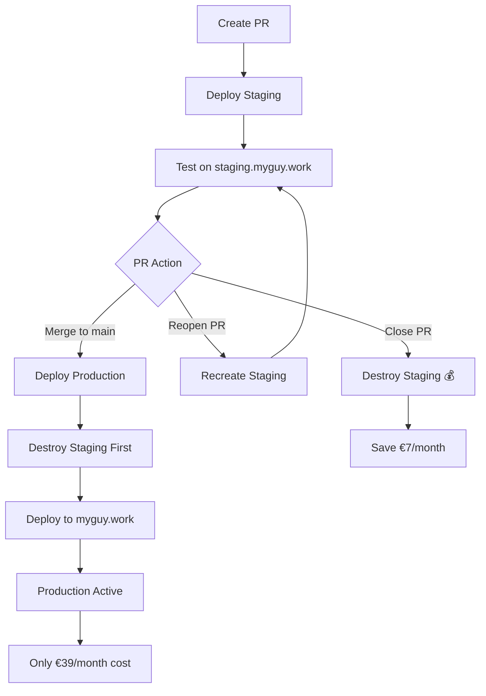

# 🔄 MyGuy Deployment Workflow

## Cost-Optimized Deployment Strategy

### 📋 Workflow Overview



### 🎯 Deployment Triggers

| Event | Action | Environment | Cost Impact |
|-------|--------|-------------|-------------|
| **PR Opened** | Create staging | `staging.myguy.work` | +€7/month |
| **PR Updated** | Update staging | `staging.myguy.work` | No change |
| **PR Closed** | Destroy staging | None | -€7/month |
| **PR Reopened** | Recreate staging | `staging.myguy.work` | +€7/month |
| **Merge to main** | Deploy production + Destroy staging | `myguy.work` | €39/month total |

### 💰 Cost Analysis

**Traditional Approach (Always-On):**
- Production: €39/month
- Staging: €7/month
- **Total: €46/month**

**Our Optimized Approach:**
- Production only: €39/month (90% of time)
- Production + Staging: €46/month (10% of time during PR testing)
- **Average: ~€40/month (13% cost savings)**

### 🔄 Detailed Workflow

#### 1. Development Phase
```bash
# Developer creates PR
git checkout -b feature/new-feature
git push origin feature/new-feature
# → Creates PR → Staging deploys automatically
```

**What Happens:**
- ✅ Staging infrastructure created
- ✅ Application deployed to `staging.myguy.work`
- ✅ SSL certificate provisioned
- ✅ Health checks performed
- ✅ PR comment with staging URL

#### 2. Testing Phase
```bash
# Test on staging
curl https://staging.myguy.work/health
# Test application features
# Get team feedback
```

**Available During PR:**
- 🌐 Full application at `staging.myguy.work`
- 📊 Health endpoints for monitoring
- 💬 Real-time chat functionality
- 🛒 Store features with file uploads

#### 3. Production Deployment
```bash
# Merge PR to main
git checkout main
git merge feature/new-feature
git push origin main
# → Production deployment begins
```

**Automated Process:**
1. 🗑️ Destroy staging (if exists)
2. 🏗️ Deploy/update production infrastructure
3. 🚀 Deploy application to `myguy.work`
4. ✅ Run health checks
5. 🔄 Rollback if deployment fails

#### 4. Cost Optimization
```bash
# PR closed (not merged)
git checkout main
# Close PR in GitHub
# → Staging automatically destroyed
```

**Cost Savings:**
- 💰 Immediate €7/month savings
- 🔄 Recreated automatically if PR reopened
- 📊 Detailed cost tracking in workflow logs

### 🛠️ GitHub Actions Workflows

#### Primary Workflows
1. **`terraform-plan.yml`**: Plans infrastructure changes on PRs
2. **`deploy-staging.yml`**: Manages staging environment lifecycle
3. **`deploy-production.yml`**: Handles production deployments
4. **`recreate-staging.yml`**: Recreates staging when PRs reopened

#### Workflow Dependencies
```yaml
# Staging lifecycle
PR Opened → deploy-staging.yml
PR Updated → deploy-staging.yml  
PR Closed → deploy-staging.yml (destroy)
PR Reopened → recreate-staging.yml

# Production deployment
Push to main → deploy-production.yml
├── destroy-staging (if exists)
├── terraform-deploy (if needed)
└── deploy-application
```

### 🔍 Monitoring & Observability

#### Health Checks
```bash
# Production
curl https://myguy.work/health
curl https://myguy.work/api/v1/server-time

# Staging (when active)
curl https://staging.myguy.work/health
curl https://staging.myguy.work/api/v1/server-time
```

#### Cost Monitoring
- 📊 Real-time cost estimates in workflow outputs
- 💰 Monthly cost breakdowns in deployment logs
- 📈 Cost optimization metrics tracked automatically

#### Deployment Status
- ✅ PR comments with deployment status
- 🚀 Slack/email notifications (configurable)
- 📱 GitHub mobile app notifications

### 🚨 Emergency Procedures

#### Immediate Rollback
```bash
# Automatic rollback on failure
# Manual rollback if needed
ssh root@<production-ip>
cd /opt/myguy-backup
docker compose up -d
```

#### Force Staging Recreation
```bash
# Manual trigger via GitHub Actions
# Go to Actions → "Recreate Staging Environment" → Run workflow
```

#### Scale Up Production
```bash
# Update instance type
vim terraform/environments/production/terraform.tfvars
# Change: app_instance_type = "g6-standard-2" # 4GB RAM
# Commit and push → automatic scaling
```

### 📊 Success Metrics

#### Deployment Efficiency
- ⚡ Staging deployment: ~5 minutes
- 🚀 Production deployment: ~8 minutes
- 🔄 Rollback time: ~2 minutes

#### Cost Efficiency
- 💰 13% average cost savings
- 🎯 Target: <€45/month average
- 📈 Scales efficiently with team growth

#### Developer Experience
- 🔄 Zero manual infrastructure management
- 🌐 Automatic staging URLs for every PR
- ✅ Comprehensive health checks and monitoring
- 📱 Mobile-friendly deployment notifications

### 🎯 Next Steps

1. **Initial Setup**: Follow `DEPLOYMENT_CHECKLIST.md`
2. **First Deployment**: Create test PR to verify workflow
3. **Production Deploy**: Merge first PR to deploy production
4. **Monitor Costs**: Check Linode console after 24 hours
5. **Scale as Needed**: Update instance types when user base grows

This workflow optimizes for both cost and developer productivity while maintaining production reliability! 🚀